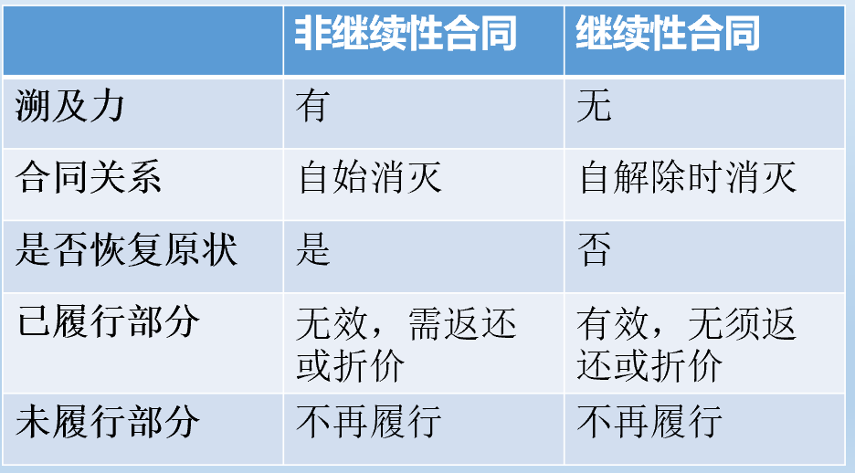

## 合同的权利义务终止
含义：指由于一定的法律事实所引起的合同当事人权利义务消灭的法律现象
原因：履行、解除、抵销`不同类型的债务不能法定抵消，但可以约定抵消`、提存、免除、混同`权利义务归于同一人`。
>提存，指由于债权人的原因而无法向其交付合同标的物时，债务人将该标的物交给提存机关而消灭债务的制度。

## 解除
一、合同解除概述
含义：指合同履行完毕之前，依一方的意思表示或双方合意，终止双方基于合同的权利义务关系。`合同应该是有效的，无效的合同自始无效，没有约束力；可撤销合同在撤销前有约束力，可以解除；效力待定合同有形式上的约束力（成立），可以解除`
特点：
- 以非无效且未履行完毕的合同为标的
- 法律后果是当事人双方均中止履行尚未履行的债务，并对已经履行的债务进行清算，从而消灭合同 `返还、折价返还、违约责任`

解除的类型：
- 合意解除
	- 协议解除
- 单方解除
	- 约定解除
	- 法定解除

### 约定解除
（一）含义
当事人约定解除的事由，在该事由发生时，当事人一方或者双方取得解除权，得以解除合同。
（二）约定解除与附条件的解除区别：
约定解除：解除事由发生，仍需当事人主动行使解除权来解除合同
附条件的解除：条件成就，合同自动解除
>《民法典》第158条：民事法律行为可以附条件，但是根据其性质不得附条件的除外。附生效条件的民事法律行为，自条件成就时生效。附解除条件的民事法律行为，自条件成就时失效。

>条件：未来发生与否不确定的事实

### 法定解除
- 一般法定解除事由：
	- 不可抗力
	- 预期违约
	- 履行延迟
	- 情势变更
	- 其他
- 特别法定解除
	- 违法转租时出租人解除权
	- 委托合同的任意解除权

（二）法定解除的事由
1. 不可抗力
因不可抗力致使不能实现合同目的`不可抗力本身只是免责事由`
- 不可抗力：不能预见、不能避免并不能克服的客观情况`针对不可抗力本身而言，不是针对不能履行合同的困难`
>不可抗力能约定吗？可以，但要满足不可抗力的条件
- 特点：
	- 债务人已尽注意义务仍无法预见
	- 债务人尽其努力也无法避免和克服
	- 导致合同目的无法实现
- 类型：自然灾害、政府行为、社会异常事件

>【案例分析】
    顾先生名下已有两处房产，为改善居住条件，2010年又通过中介找到一处房源。与房主签订二手房买卖合同约定，合同签订后30日内不交齐房款480万元的，定金10万元归房主所有。
    在此期间，政府调控房价，限制对三套房发放商业贷款，顾先生无法从银行获得贷款，难以筹集资金支付房款。为此顾先生找到陈律师咨询，陈律师出的主意是以“因为银行贷款政策改变办不出贷款属不可抗力，按照我国《民法典》，在此情况下可以单方面终止合同而不用赔偿损失”。顾先生遂以此为由于卖家交涉，请求解除合同，并返还定金。
    请问：陈律师的意见是否正确？`不正确，1.不一定是不可抗力，贷款政策的变化有可能是可以预见的。 2.不可抗力不能导致合同目的不能实现`
	
2. 预期违约 
- 特征：能履行但提前表示不履行
- 要件：
	- 合同成立后，履行期限届满前
	- 一方当事人明确表示（明示）或者以自己的行为表明（默示）不履行主要债务
- 救济：
	- 解除合同
	- 待履行期限届满要求对方承担违约责任

3. 履行迟延 
- 特征：能履行但期满未履行
- 分类：依据履行期限对当事人的意义不同：
	- 定期行为（无需催告）`合同的目的和期限有关`
	- 非定期行为（催告）
>《民法典》第563条：第五百六十三条 有下列情形之一的，当事人可以解除合同：
（一）因不可抗力致使不能实现合同目的；
（二）在履行期限届满前，当事人一方明确表示或者以自己的行为表明不履行主要债务；（三）当事人一方迟延履行主要债务，经催告后在合理期限内仍未履行；
（四）当事人一方迟延履行债务或者有其他违约行为致使不能实现合同目的；
（五）法律规定的其他情形。
以持续履行的债务为内容的不定期合同，当事人可以随时解除合同，但是应当在合理期限之前通知对方。

4. 其他致使合同目的不能实现的违约行为 
- 基本要求：根本违约`导致合同的目的无法实现才是合同被解除的根本原因`
-类型：
	- 拒绝履行
	- 部分履行
	- 不完全履行
	- 不履行附随义务
	
5. 不定期继续性合同的通知解除 
>《民法典》第563条第二款：以持续履行的债务为内容的不定期合同，当事人可以随时`不需要催告`除合同，但是应当在合理期限之前通知对方。

>【思考】
定期的继续性合同如何解除？
协议解除，单方约定解除
《民法典》第1022条规定，当事人对肖像许可使用期限没有约定或者约定不明确的，任何一方当事人可以随时`解除`肖像许可使用合同，但是应当在合理期限之前通知对方。当事人对肖像许可使用期限有明确约定，肖像权人有`正当理由的`，可以解除肖像许可使用合同，但是应当在合理期限之前通知对方。因解除合同造成对方损失的，除不可归责于肖像权人的事由外，应当赔偿损失。`这种正当理由、重大事由即是牺牲相对人信赖利益的理由` `法理上，该原则可以类推至所有定期继续性合同`

继续性合同：终止
非继续性合同：解除

6. 合同僵局下的司法解除？ 
>《民法典》第580条：
      当事人一方不履行非金钱债务或者履行非金钱债务不符合约定的，对方可以请求履行，但是有下列情形之一的除外：
	  （一）法律上或者事实上不能履行；
	  （二）债务的标的不适于强制履行或者履行费用过高；
	  （三）债权人在合理期限内未请求履行。
　　有前款规定的除外情形之一，致使不能实现合同目的的，人民法院或者仲裁机构可以根据`当事人`的请求终止合同权利义务关系，但是不影响违约责任的承担。`当事人：违约方也可以`
  
  >《民法典》第 579 条【金钱债务的违约责任】当事人一方未支付价款、报酬、租金、利息，或者不履行其他金钱债务的，对方可以请求其支付。`金钱债务不存在履行不能`

【思考】
此款是否给违约方解除合同开了后门？

### 解除程序
解除权为形成权，一般情况下，解除合同的意思表示到达对方当事人，合同即解除
通知解除：当事人一方依法主张解除合同的，应当通知对方，合同自通知到达对方时解除
诉讼/仲裁解除：当事人一方未通知对方，直接以提起诉讼或者申请仲裁的方式依法主张解除合同，人民法院或者仲裁机构确认该主张的，合同自起诉状副本或者仲裁申请书副本送达对方时解除

解除合同需要办理特别手续的（登记、批准），办理手续后方可解除
一方主张解除合同，对方有异议的，任何一方当事人均可以请求人民法院或者仲裁机构确认解除行为的效力`对抗形成权`
特殊情况：因情势变更或合同僵局解除合同，只能通过法院或仲裁机构进行

解除权的行使期限
- 当事人约定/法律规定
- 催告后合理期限
- 自解除权人知道或者应当知道解除事由之日起一年内

>《民法典》第564条：
法律规定或者当事人约定解除权行使期限，期限届满当事人不行使的，该权利消灭。
法律没有规定或者当事人没有约定解除权行使期限，自解除权人知道或者应当知道解除事由之日起一年内不行使,或者经对方催告后在合理期限内不行使的，该权利消灭。

### 解除的法律后果
1. 溯及力

2.合同解除与损害赔偿
- 可并存 `损害赔偿是因为对方根本违约而产生的`
- 损害赔偿范围：信赖利益`恢复到合同订立之前——一方基于对另一方将与其订约的合理信赖所产生的利益`/履行利益`恢复到合同履行完毕之后——合同履行得到的利益`

>《民法典》第566条：合同解除后，尚未履行的，终止履行；已经履行的，根据履行情况和合同性质，当事人可以请求恢复原状或者采取其他补救措施，并有权请求赔偿损失。

>【练习】
2016年8月8日，玄武公司向朱雀公司订购一辆小型客车。2016年8月28日，玄武公司按照当地政策取得本市小客车更新指标，有效期至2017年2月28日。2016年底，朱雀公司依约向玄武公司交付了该小型客车，但未同时交付机动车销售统一发票、合格证等有关单证资料致使玄武公司无法办理车辆所有权登记`对抗要件`和牌照。关于上述购车行为，下列哪些说法是正确的？（ABC）
A.玄武公司已取得该小客车的所有权`取得了，但不得对抗第三人`
B.玄武公司有权请求朱雀公司交付有关单证资料`继续履行从给付义务`
C.如朱雀公司一直拒绝交付有关单证资料，玄武公司可以解除购车合同`可以，`
D.朱雀公司未交付有关单证资料，属于从给付义务的违反，玄武公司可主张违约责任，但不得主张解除合同

>【思考】合同能否解除？
中国A公司从德国B公司进口一套大型生产设备，分三批交货，第一批交付设备的主要部件，第二和第三批交付设备的零配件。德国B公司交付的第一批货物没有问题，但第二批货物的型号、性能与合同不符，导致设备无法安装投产。A公司因此提出解除整个合同，而B公司提出异议。哪方有理？`能，已经达到了合同目的无法实现的情形。但要求给B予以补救的实践，`

>【思考】销路不畅的麻纺织品
甲公司与乙公司签订了购销麻纺织品的合同，约定由甲公司于某年12月底之前交付200吨麻纺织品给乙公司。
而当乙公司收到100吨货物后，明确通知甲公司由于麻纺织品销路不畅，提出解除合同，要求甲公司停止交货。甲公司不同意，仍然安排生产与交货。乙公司认为合同已经解除，拒绝收货。
如何处理？`不能，不构成法定解除的条件，且非约定解除` `甲要履行减损义务`

>约定解除，法定解除
>法定解除是强制性的么？即是否可以约定未到根本违约即解除合同

