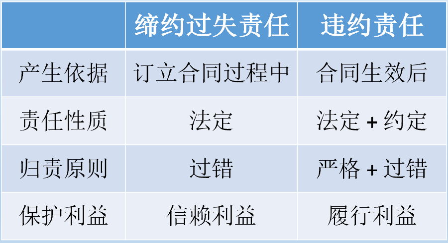
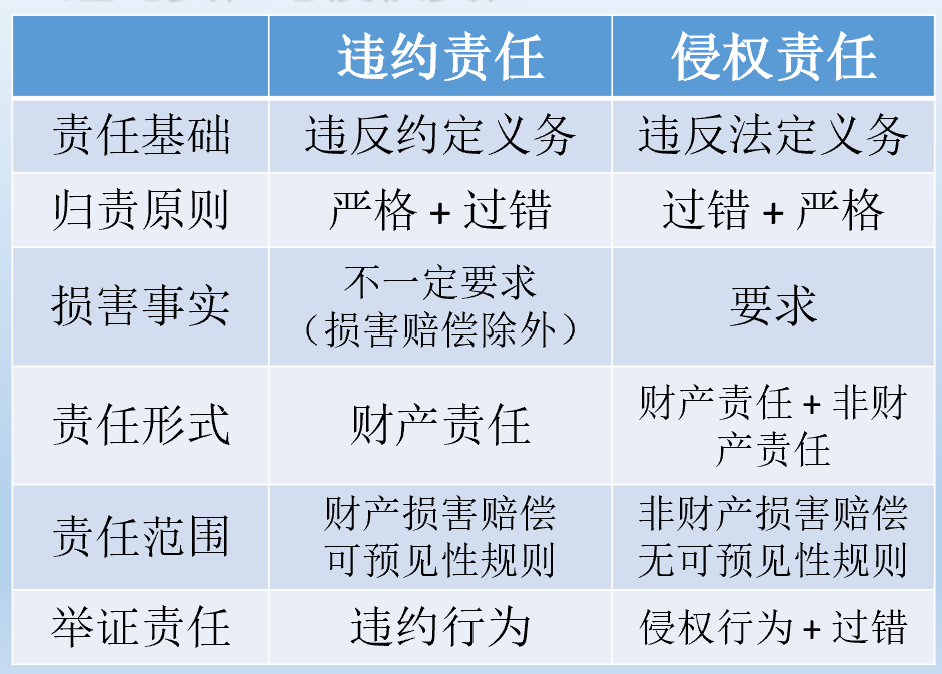
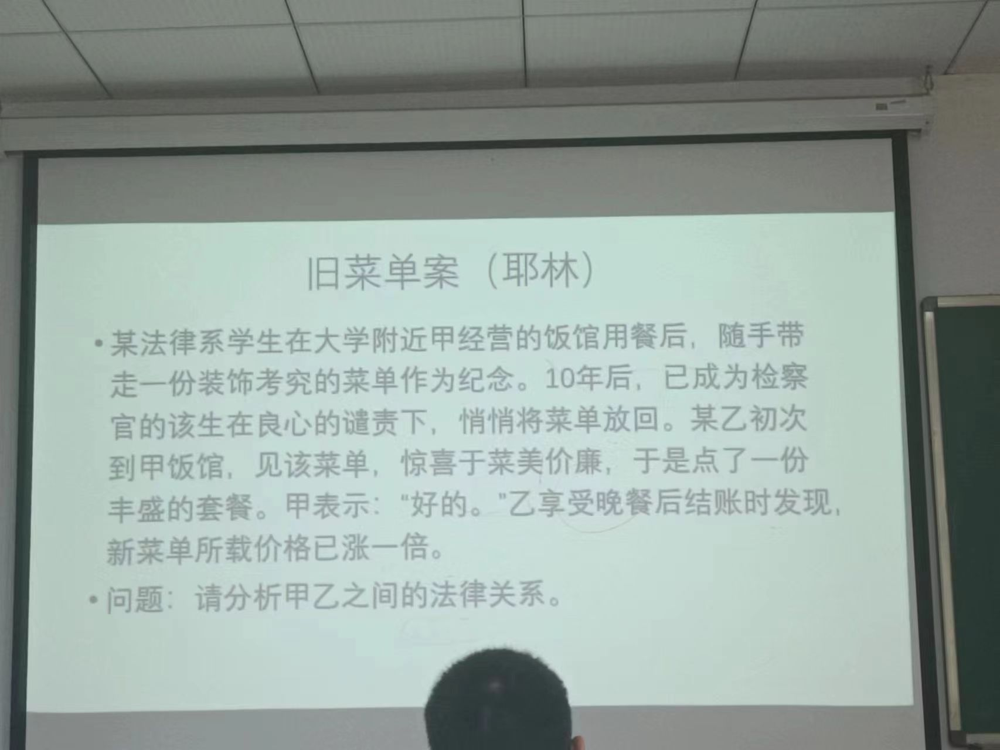

## 违约责任的概述
一、概念
  当事人不履行或者不按约定履行合同义务所应承担的民事法律后果
  
二、违约责任的特征
- 主要是财产责任
- 主要是补偿性责任`和惩罚性责任的区别`
- 兼具强制性与任意性的特点

三、违约责任的归责原则
1. 过错责任与严格责任
- 过错责任：当事人只有在主观上有过错时方承担违约责任
- 严格责任：不以当事人在主观上有过错为要件，当事人有违约行为即应承担违约责任
2. 立法例
大陆法系：过错责任为原则`在过错推定上向严格责任靠近`
英美法系：严格责任为原则`同样可以约定免责事由`
《国际商事合同通则》：违反结果性义务的，承担严格责任；违反方式性义务的，承担过错责任
《联合国国际货物销售合同公约》和《欧洲示范民法典草案》：严格责任原则
3. 我国法上违约责任的归责原则
- 一般归责原则：严格责任
- 部分特别合同：过错责任

>【法条链接】
《民法典》第577条：当事人一方不履行合同义务或者履行合同义务不符合约定的，应当承担继续履行、采取补救措施或者赔偿损失等违约责任。`不要求过错`
《民法典》第660条：因赠与人故意或者重大过失致使赠与的财产毁损、灭失的，赠与人应当承担赔偿责任。`一般性过失，不需要`

## 概念辨析
1. 缔约过失责任与违约责任

2. 违约责任与侵权责任

特定合同允许违约责任存在精神补偿
侵权责任的举证责任更重

一、履行不能 `金钱债务不能不行不能`
1. 含义：指债务人由于某种原因，已不可能履行合同义务
2. 特点：“非不为也，实不能也”
3. 注意：金钱之债和种类之债一般不发生履行不能`种类之债在特定化之前不会发生履行不能`
4. 履行不能的法律后果
	1. 债务人的给付义务：一律免除
		   `原合同义务，次合同义务：因为原合同义务未履行产生的义务，违约责任一般认为是次合同义务`
	2. 债务人是否承担违约责任
		- 债务人导致：承担
		- 债权人导致：不承担`免责事由`
		- 第三人导致：承担
		- 不可抗力导致：不承担`免责事由`
	3. 满足解除条件的，当事人可以解除合同

只要约定一个事由就可以排除所有的法定解除事由吗？

二、拒绝履行
1. 含义：指债务人能够履行而无正当理由不履行合同义务
2. 特点：“非不能也，实不为也”
3. 注意：拒绝履行的前提，是履行尚为可能
4. 法律后果
	1. 债务人应承担违约责任
		继续履行 `履行不能不能要求继续履行`
		损害赔偿
	2. 满足解除条件的，债权人可解除合同 `具有还要看合同目的是否实现`

三、履行迟延
1. 构成要件
	债务已届清偿期
	能够履行而未履行 `履行不能的债务因为被免除了给付义务，故不可能履行迟延`
	债务不履行无正当理由 `顺序履行抗辩 不安抗辩`
2. 履行迟延的法律后果：
	1. 债务人应承担债务迟延履行的责任
		继续履行
		损害赔偿 
	2. 债务人责任加重
		①对不可抗力负责（《民法典》第590条）`在迟延后发生的不可抗力不免除违约责任，如果没有陷入迟延，合同仍会被不可抗力影响的排除适用`
		②价格制裁（《民法典》第513条）
		>民法典 第五百一十三条 执行政府定价或者政府指导价的，在合同约定的交付期限内政府价格调整时，按照交付时的价格计价。 逾期交付标的物的，遇价格上涨时，按照原价格执行；价格下降时，按照新价格执行。 逾期提取标的物或者逾期付款的，遇价格上涨时，按照新价格执行；价格下降时，按照原价格执行

		③金钱之债中，需支付逾期利息
		1. 满足条件时，债权人可解除合同
一般的给付迟延：经债权人催告后，债务人在合理期限内仍未履行，债权人可解除合同
		2. 给付迟延导致合同目的无法实现的，债权人无需催告，可立即解除合同
		
四、不完全履行
1. 构成要件
	债务人履行了债务
	但该履行并不全面、适当，存在不符合合同约定或者法律规定的情形 `除了时间`
	债务人不完全履行无正当理由 `抗辩`
2. 不完全履行的类型
	- 依违反义务的种类：违反给付义务、违反附随义务
	- 依不完全履行的情形：给付标的物瑕疵`物的瑕疵 权利瑕疵（物上附有别人的权利，如抵押）`、给付方法瑕疵、给付时间瑕疵`提前履行通常不认为是违约`、给付地点瑕疵等
	- 依损害程度：
		瑕疵给付：债务的不当履行造成债权人履行利益的损害
		加害给付：债务的不当履行造成债权人履行利益之外的其他利益（固有利益）损害
3. 不完全履行的法律后果
	1. 瑕疵给付的后果
		继续履行
		采取补救措施（修理、更换、重作`承揽合同`）`在合理性之下由不完全履行`
		
	>《民法典》第五百八十二条 履行不符合约定的，应当按照当事人的约定承担违约责任。对违约责任没有约定或者约定不明确，依据本法第五百一十条的规定仍不能确定的，受损害方根据标的的性质以及损失的大小，可以合理选择请求对方承担修理、重作、更换、退货、减少价款或者报酬等违约责任。
		  
	减少价款或者报酬
	解除合同（根本违约情况下）`参考迟延履行的催告，在可以通过修理消除瑕疵时，应给其修理更换的机会，如若再出现瑕疵，可以在失去信任后解除合同`
	损害赔偿`还有加害给付责任`
	2. 加害给付的后果
	损害赔偿
	责任竞合

五、债权人迟延
1. 含义：又称受领迟延，指债权人未为债务人履行债务提供必要的协助
2. 性质：非违约行为，因为受领乃债权人权利，或称“不真正义务”
3. 债权人迟延的法律后果
	债务人可通过提存消灭债务
	风险自债权人迟延之日起转移
	
### 违约责任的承担方式

一、继续履行
1. 概念：又称实际履行、强制履行，指按照合同约定的方式继续履行
2. 不适用实际履行的情况（非金钱债务）
	法律上或者事实上不能履行`法律上不能：法律禁止流通`
	债务标的不适合或者履行费用过高`履行费用：履行费用和履行利益相差很大；标的不适合：标的有人身性，债务人生病`	债权人在合理期限内未要求履行
	
3. 替代履行（《民法典》新增）
>《民法典》第581条：
当事人一方不履行债务或者履行债务不符合约定，根据债务的性质不得强制履行的，对方可以请求其负担由第三人替代履行的费用。

二、损害赔偿（赔偿损失）
1. 含义：当事人不履行合同债务时，为弥补对方损失而向其支付一定数额金钱
2. 损害赔偿的分类
	约定损害赔偿与法定损害赔偿
	代替履行的损害赔偿`赔偿代替了实际履行`与迟延损害赔偿`赔了还要继续履行`（与履行并存的损害赔偿）
3. 损害赔偿的构成要件
	违约行为`不要求损害是违约的唯一原因`
	损害
	因果关系
	无免责事由
4. 损害的分类
	- 期待利益（履行利益、积极利益）损害、信赖利益（消极利益）损害与固有利益损害`通常要求赔偿履行利益 固有利益，信赖利益为缔约过失责任`
	- 财产损害与非财产损害`旅游合同 精神损害`
	- 积极损害（所受损失）与消极损害（所失利益）
	- 直接损失与间接损失`因果关系的直接与间接`

5. 损害赔偿的范围
（1）基本规则：完全赔偿
	含义：违约方应赔偿相对人因其违约所导致的全部损害，使相对人利益恢复到没有受到损害时的状态
	包括所受损失和所失利益`积极损害和消极损害`	
	所失利益包括生产利润损失、经营利润损失和转售利润损失
（2）损害赔偿的限制
- 可预见性规则
	- 概念：赔偿范围不得超过`违约`一方订立合同时`预见到`或者`应当预见到`的因违约可能造成的损失`不应该具体到损失的数额，应只有损害的类型`
	- 只适用于法定损害赔偿 
	- 不适用于故意或者重大过失以及欺诈的违约行为
- 与有过失规则（过失相抵）
	- 受害人对于损害的发生或者扩大有过错的，可以减轻或者免除违约方的赔偿责任。
- 减轻损失规则
	- 受害人应及时采取措施防止损失扩大，否则无权就扩大的损失要求赔偿。
- 损益相抵规则
	- 违约方因违约所需支付的赔偿额应当减去非违约方因违约而减少的支出或者获得的利益（计算“净损失”）`保险的情况下，保险公司获得了向违约债务人追偿的权利`

6. 损害赔偿与其他违约救济方式的关系
（1）损害赔偿与继续履行`区分代替履行损害赔偿和迟延履行损害赔偿`
（2）损害赔偿与合同解除`合同解除后能要求赔偿迟延、替代履行损害赔偿
`

三、违约金
1. 含义：依约定或法律规定，由违约方向相对方支付一定`数额`的金钱或者财物
2. 特征
	- 数额是预先确定的
	- 是违约后生效的补救方式
	- 约定的违约金数额可能与实际损失不相当
3. 违约金的种类
	-  补偿性违约金与惩罚性违约金
	- 法定违约金与约定违约金 `法定违约金种类很少`
4. 违约金的增减 `事先越低，难免出现与实际损失不符` `没有意思自治，由法院裁决`
- 低于损失的，可请求予以增加
	- “过分”高于造成的损失的（超过30%），可请求予以“适当”减少
	- 对违约金数额的调整，法院应依当事人请求作出，不得依职权行使
5. 违约金与其他违约救济方式的关系
（1）违约金与损害赔偿 `事先&事后`
>可以即约定违约金又要求承担损害赔偿吗？
可以，可以约定不能被我已经覆盖的部分承担损害赔偿

（2）违约金与继续履行
>可以要求既赔偿违约金又继续要求继续履行，和迟延损害赔偿类似；不履行的违约金替代履行，不能要求继续履行

（3）违约金与合同解除
>参见损害赔偿

（4）违约金与（违约）定金
- 当事人可以约定一方向对方给付定金作为债权的担保。
- 债务人履行债务的，定金应当抵作价款或者收回。
- `给付定金的一方`不履行债务或者履行债务不符合约定，致使不能实现合同目的的，无权请求返还定金；`收受定金的一方`不履行债务或者履行债务不符合约定，致使不能实现合同目的的，应当双倍返还定金`相当于付出了一份定价的代价`。
- 当事人既约定违约金，又约定定金的，一方违约时，对方可以选择适用违约金或者定金条款。
- 定金不足以弥补一方违约造成的损失的，对方可以请求赔偿超过定金数额的损失。
>定金&订金
>定价采用定金罚则，订金视为预付款
>和违约金都要履约担保的功能，违约金和实际损失挂钩更大，
>定价不足实际损失，可以要求承担损害赔偿
>定金多过30%，通常不能要求调低（履约担保）但法律规定，定金不能超过合同标的额的20%

定金是要物合同，以交付数额为准
既约定了定金，又约定了违约金，违约方可以二选一，因为两个重合了

四、减价
1. 含义：合同一方当事人交付的标的物质量不符合约定时，非违约方予以接受，并相应减少价款或者报酬`减价不需要相对人的同意`
2. 性质：形成权 `可以诉讼，救济`
3. 减价与其他违约救济方式的关系
（1）减价与继续履行 
>不能要求继续履行，因为相冲突，用减价作为接受瑕疵的代价

（2）减价与损害赔偿/违约金
>先迟延履行，又瑕疵履行，可以要求减价和损害赔偿，但他们不能针对同一种

（3）减价与合同解除
>减价不能解除合同，因为减价已经接受了瑕疵

> 【练习】（多选）
　　甲与乙签订房屋买卖合同，将一幢房屋卖与乙。双方同时约定，一方违约应支付购房款35％的违约金。但在交房前甲又与丙签订合同，将该房卖与丙，并与丙办理了过户登记手续。下列说法中哪些是正确的？C`D`
　　A.乙可以自己与甲签订的合同在先，主张甲与丙签订的合同无效`债的平等性，时间先后不影响合同效力的大小`
　　B.乙有权要求甲收回房屋，实际履行合同`履行不能了`
　　C.乙不能要求甲实际交付该房屋，但可要求甲承担违约责任
　　D.若乙要求甲支付约定的违约金，甲可以请求法院或仲裁机构予以适当减少`购房款是损失吗？如果房价不变，可以认为是，但通常情况下不认为是实际损失`
  
  
 >【练习】（不定项）
  2018年1月3日, 甲公司和乙公司签订电脑买卖合同, 约定由甲公司以每台1万元的价格向乙公司出售100台电脑。2018年1月5日, 甲公司将电脑送到乙公司处, 并要求乙公司支付货款。乙公司经检查发现甲公司所交付的电脑中有10台不符合约定的要求, 其配置远远低于合同约定的配置。关于本案, 下列说法正确的有?  (　CD　)
  A. 乙公司有权解除电脑买卖合同 `通常情况下不认为是根本违约`
  B. 乙公司有权拒绝支付全部价款
  C. 乙公司有权要求更换该10台电脑
  D. 乙公司有权要求减少10台不符合约定配置的电脑的价款

### 违约责任的免责事由
一、免责事由的类别
法定免责事由：又称免责条件，指法律直接规定的当事人对其违约行为不承担违约责任的事由
约定免责事由：指当事人约定的免除或限制未来违约责任的事由，一般表现为合同中的免责条款

二、 法定免责事由
1. 不可抗力
>《民法典》第180条：因不可抗力不能履行民事义务的，不承担民事责任。法律另有规定的，依照其规定。
　　不可抗力是不能预见、不能避免且不能克服的客观情况。
《民法典》第590条：当事人一方因不可抗力不能履行合同的，根据不可抗力的影响，部分或者全部免除责任，但是法律另有规定的除外。…… 
`违约100%由不可抗力造成，才能100%免责，实践中不一定是100%`
　　当事人迟延履行后发生不可抗力的，不免除其违约责任。`除非是没有迟延履行也会发生不可抗力，不可抗力和迟延履行之间没有因果关系`
  
2. 货物本身的自然性质或合理损耗
>《民法典》第832条：承运人对运输过程中货物的毁损、灭失承担损害赔偿责任。`严格责任`但是，承运人证明货物的毁损、灭失是因不可抗力、货物本身的自然性质或者合理损耗……造成的，不承担赔偿责任。

和不可抗力一样，部分-部分的情况根据比例承担责任和免除责任

3. 债权人的过错
>《民法典》第832条：承运人对运输过程中货物的毁损、灭失承担损害赔偿责任。但是，承运人证明货物的毁损、灭失是因……托运人、收货人的过错造成的，不承担赔偿责任。
《民法典》第823条：承运人应当对运输过程中旅客的伤亡承担赔偿责任；但是，伤亡是旅客自身健康原因造成的或者承运人证明伤亡是`旅客故意、重大过失造成`的除外。
《民法典》第893条：寄存人交付的保管物有瑕疵或者根据保管物的性质需要采取特殊保管措施的，寄存人应当将有关情况告知保管人。寄存人未告知，致使保管物受损失的，保管人不承担赔偿责任；……

三、约定免责事由
- 免责条款的限制
- 免责条款的合理性

>《民法典》第506条：合同中的下列免责条款无效：
（一）造成对方人身损害的；
（二）因故意或者重大过失造成对方财产损失的。
《民法典》第497条【格式条款】：有下列情形之一的，该格式条款无效：
（一）具有本法第一编第六章第三节和本法第五百零六条规定的无效情形；
（二）提供格式条款一方`不合理`地免除或者减轻其责任、加重对方责任、限制对方主要权利；
（三）提供格式条款一方排除对方主要权利。

>约定免责事由能排除法定免责事由吗？
双方都排除使用不可抗力。可以
有些情况不行，人身权利

### 违约责任和侵权责任的竞合
1. 竞合的含义：同一不法行为，既符合违约责任的构成要件，又符合侵权责任的构成要件，导致两种民事责任并存，但因责任内容相同，`当事人只能择一适用`。`加害给付`
2. 违约责任与侵权责任竞合的特点
	- 行为人仅实施了一个不法行为
	- 该不法行为既符合违约责任的构成要件，又符合侵权责任的构成要件，从而产生两个民事责任并存的状态
	- 承担责任的必须是同一人
	- 受害人只能择一请求

>《民法典》第186条：因当事人一方的违约行为，损害对方人身权益、财产权益的，受损害方有权选择请求其承担违约责任或者侵权责任。

3. 违约责任与侵权责任竞合的具体表现
	- 买卖合同中的加害给付
	- 租赁合同中的加害给付 `黑车`
	- 医疗事故中医疗机构的责任
	- 保管合同保管人的责任
	- 运输合同中承运人的责任
	- 旅游合同中旅游经营者的责任

>【练习】
  甲商场促销期间，乙前往购买一台豆浆机时，甲商场免费附赠了一罐奶粉。食用该奶粉后，乙因奶粉质量问题上吐下泻，乙请求甲商场承担赔偿责任，甲商场以乙未支付奶粉对价为由拒绝赔偿。对此，下列说法正确的是？ABD
A.乙可请求甲商场承担违约责任 `奶粉是附条件的，应是无瑕疵的，违反给付义务`
B.乙可请求甲商场承担侵权责任
C.由乙自行承担损失
D.可请求奶粉的生产商承担侵权责任 `和生产商没有合同，只能要求承担侵权责任`

>【思考】涨价的机床
3月5日，北京某工业供销公司（买方）与荷兰碧海有限公司（卖方）签订了一份进口机床的合同。合同规定：由卖方在12月7日前交付买方机床100台，总价值5万美元，货到3日内全部付清。7月7日，卖方来函：因机床价格上涨，全年供不应求，除非买方同意支付6万美元，否则卖方将不交货。`预期违约` 对此，买方表示按合同规定价格成交。买方曾经于7月7日询问另一家公司寻找替代物，但新供应商可以在12月7日前交付100台机床并要求支付价款5.6万美元。`没有采取行动弥补损失，而导致损失扩大`买方当即未立即补进。到12月7日，买方以当时的6.1万美元的价格向另一供应商补进100台机床。对于差价损失，买方向法院提起诉讼，要求卖方赔偿其损失。
问：法院该如何判决？
买方在7.7没有补进就是没有尽到减损义务吗？在价格变动下，假设7.7的价格高于了12.7的价格，那能要求赔偿吗？ 只能认定机床的市场价格一直上升，否则在价格波动的情况下，不能认为7.7是没有尽到减损义务的情形。

旧菜单案

意思主义的解读——意思表示的发出人认为的意思表示——合同不成立
表示主义的解读——意思表示的受领人认为的意思表示——合同
意思表示的一直——必备条款的意思表示
餐饮合同服务价格是必备的条款吗？应该是

