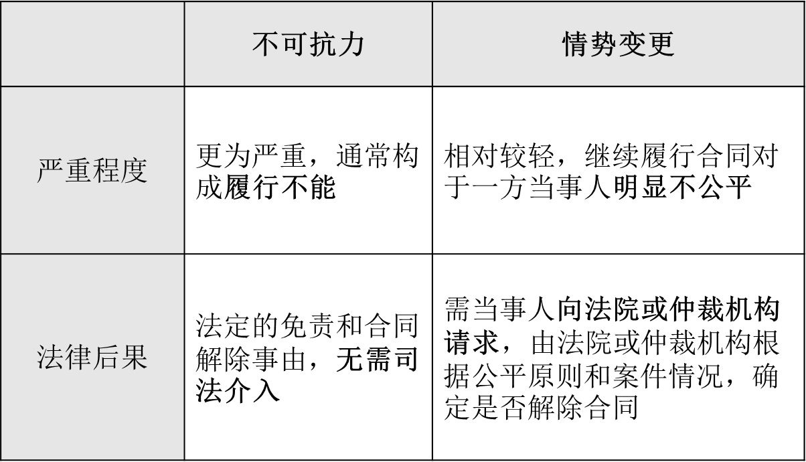

### 合同履行的概述
一、履行的含义
- 给付：债务人应为的特定行为（抽象、静态）
- 履行：债务人为给付（具体、动态）
- 清偿：债权的满足（履行和给付的结果）

二、合同履行的原则
- 全面履行原则（适当履行原则）
- 协作履行原则 
- 亲自履行原则

三、合同履行的要素（《民法典》第470、510、511条）
1. 履行主体
- 债务人
- 第三人
>《民法典》第523条：当事人约定由第三人向债权人履行债务，第三人不履行债务或者履行债务不符合约定的，债务人应当向债权人承担违约责任。

2. 履行标的
- 质量（《民法典》第511条第1项）
	- 强制性国家标准
	- 推荐性国家标准
	- 行业标准
	- 通常标准`客观的标准`或者符合合同目的的特定标准`主观的标准`

>【思考】上述顺序是否合理？先适用强制性国家标准，不宜提出过高的要求
- 数量
	- 部分履行：债权人原则上可拒绝，但不损害其利益的除外。`基于协作履行的原则，债权人应当接受部分履行`
	- 超量履行？给予对价或返还多的，否则构成不当得利

3. 履行地点
- 履行地点的确定：（《民法典》第511条第3项）
	- 约定
	- 一般情况：债务人住所地
	- 金钱债务：债权人住所地`都是在出卖人所在地`
	- 不动产：不动产所在地
- 确定履行地点的意义：履行风险`在运送到交付地点前，风险由出卖人承担`、费用、合同价款以及纠纷管辖`没有约定管辖法院，在履行地点的法院`的确定

4. 履行期限
- 期日和期间
- 约定不明时：随时履行`511条第四款`
- 迟延履行：违约责任
- 提前履行：债权人原则上可拒绝，但不损害其利益的除外。`债务人享有期限利益，在此期间没有交付的义务。提前履行一般是有利于债务人`

5. 履行费用
- 约定不明时，由履行义务一方承担
- 因债权人原因增加的履行费用，由债权人负担`受领迟延`
- 典型合同分编中的特别规定`委托合同中，委托人通常要预付受托人的费用`

> 【司考真题】（多选）
     A市甲厂与B市乙厂签订了一份买卖合同,约定由甲厂供应乙厂钢材10吨,乙厂支付货款3万元。但合同付款地点和交货地点未约定,双方为此发生纠纷。付款地点和交货地点应为:(  AB  )`没有约定都在出卖人所在地`
A.付款地点为A市
B.交货地点为A市
C.付款地点为B市
D.交货地点在B市

>《民法典》第五百一十一条 当事人就有关合同内容约定不明确，依据前条规定仍不能确定的，适用下列规定：
（一）质量要求不明确的，按照强制性国家标准履行；没有强制性国家标准的，按照推荐性国家标准履行；没有推荐性国家标准的，按照行业标准履行；没有国家标准、行业标准的，按照通常标准或者符合合同目的的特定标准履行。
（二）价款或者报酬不明确的，按照订立合同时履行地的市场价格履行；依法应当执行政府定价或者政府指导价的，依照规定履行。
（三）履行地点不明确，给付货币的，在接受货币一方所在地履行；交付不动产的，在不动产所在地履行；其他标的，在履行义务一方所在地履行。
（四）履行期限不明确的，债务人可以随时履行，债权人也可以随时请求履行，但是应当给对方必要的准备时间。
（五）履行方式不明确的，按照有利于实现合同目的的方式履行。
（六）履行费用的负担不明确的，由履行义务一方负担；因债权人原因增加的履行费用，由债权人负担。

## 合同履行的抗辩权
一、抗辩权概述
1. 含义：权利主体对抗相对人的请求权或其他权利，永久或暂时阻止其发生效力的权利
2. 类型
- 一时性抗辩权（延期抗辩权）`合同履行在一般都是`
- 永久性抗辩权 `时效`

二、同时履行抗辩权
1. 概念
双务合同的当事人一方在相对人未为对待给付以前，可以拒绝履行自己的债务之权利
>《民法典》第525条：当事人互负债务，没有先后履行顺序的，应当同时履行。一方在对方履行之前有权拒绝其履行请求。一方在对方履行债务不符合约定时，有权拒绝其相应的履行请求。

2. 构成要件
- 双务合同，互负债务，且债务间有牵连关系`有对价关系，不能对附随义务提出不履行主债务`
- 双方履行时间没有先后顺序
- 双方债务均已届清偿期
- 对方未（提出）履行或者未适当履行

3. 法律效力
   在对方履行前可拒绝履行或拒绝相应的履行
   
三、先履行抗辩权（顺序履行抗辩权）
概念
有先后履行顺序的双务合同，在应当先履行一方未履行其债务之前，后履行一方可以拒绝履行自己的债务之权利

>《民法典》第526条：当事人互负债务，有先后履行顺序，应当先履行债务一方未履行的，后履行一方有权拒绝其履行请求。先履行一方履行债务不符合约定的，后履行一方有权拒绝其相应的履行请求。

2. 构成要件
- 双务合同，互负债务，且债务间有牵连关系
- 双方履行时间存在先后顺序
- 先履行方的债务已届清偿期`不要求后履行方债务已届清偿期，但没有必要`
- 先履行方未履行或者未适当履行
3. 法律效力
后履行方有权拒绝履行或拒绝相应的履行

四、不安抗辩权
1. 概念
>《民法典》第527条：应当`先履行债务`的当事人，有确切证据证明对方有下列情形之一的，可以中止履行：
 （一）经营状况严重恶化；
 （二）转移财产、抽逃资金，以逃避债务；
 （三）丧失商业信誉；
 （四）有丧失或者可能丧失履行债务能力的其他情形。
　　当事人没有确切证据中止履行的，应当承担违约责任。
  
2. 构成要件
- 双务合同，互负债务，且债务间有牵连关系
- 双方履行时间存在先后顺序
- 先履行方的债务已届清偿期
- 先履行一方有确切证据，证明对方于合同成立后丧失或可能丧失履行能力
3. 法律效力
- 先履行方可中止履行，但应及时通知对方`提请不安抗辩`
- 在合理期限内，对方恢复履行能力或者提供适当担保的，先履行方应当恢复履行
- 在合理期限内，对方未恢复履行能力且未提供适当担保的，视为以自己的行为表明不履行主要债务（§§ 563, 578），中止履行的一方可以解除合同并可以请求对方承担违约责任
>《民法典》第 578 条【预期违约】当事人一方明确表示或者以自己的行为表明不履行合同义务的，对方可以在履行期限届满前请求其承担违约责任。

> 【司考真题】（单选）
 甲、乙订立一份价款为十万元的图书买卖合同，约定甲先支付书款，乙两个月后交付图书。甲由于资金周转困难只交付五万元，答应余款尽快支付。两个月后甲要求乙交付图书，遭乙拒绝。对此，下列哪一表述是正确的？（D）
　　A.乙对甲享有同时履行抗辩权
　　B.乙对甲享有不安抗辩权
　　C.乙有权拒绝交付全部图书
　　D.乙有权拒绝交付与五万元书款价值相当的部分图书
  
## 情势变更
一、情势变更概述
- 含义：指合同成立以后，合同的基础条件发生了当事人在订立合同时无法预见的、不属于商业风险的重大变化
- 德国法：交易基础丧失
- 英美法：合同（目的）落空
`保护了公平原则，违反了合同严守`
>《民法典》第533条：
        合同成立后，合同的基础条件发生了当事人在订立合同时无法预见的、不属于商业风险的重大变化，继续履行合同对于当事人一方明显不公平的，受不利影响的当事人可以与对方重新协商；在合理期限内协商不成的，当事人可以请求人民法院或者仲裁机构变更或者解除合同。
         人民法院或者仲裁机构应当结合案件的实际情况，根据公平原则变更或者解除合同。
		 
二、构成要件
1. 合同成立之后，履行完毕之前，合同的基础条件发生了重大变化`基础条件指客观条件，非动机`
2. 该变化不可归责于当事人，也非当事人在合同订立时可以预见
3. 该变化非不可抗力，亦非商业风险`不可抗力本身就是解除合同的事由，且更为容易`
4. 该变化导致继续履行合同对一方当事人明显不公平

三、法律后果
- 受不利影响的当事人可以与对方重新协商
- 在合理期限内协商不成的，当事人可以请求人民法院或者仲裁机构变更或者解除合同`法院单方变更的地方只有这一处`
- 人民法院或者仲裁机构应当结合案件的实际情况，根据公平原则变更或者解除合同

`不可抗力是法定的免责事由，如果合同目的无法实现，还是解除事由；不可抗力通常造成履行不能`