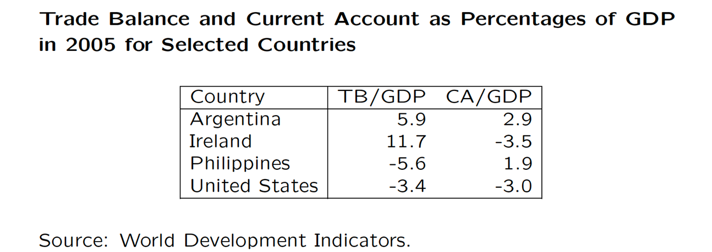

## 三、国际收支失衡

自主性交易
: 又叫事前交易，是指因经济上的某种目的而自动进行的交易。

调节性交易
: 又叫事后交易或补偿性交易，是指为平衡国际收支而被动进行的交易。
***自主性交易收支平衡为国际收支均衡***
但现实中很难区分自主性交易和调节性交易
#### 国际收支不平衡的口径
贸易差额：货物和服务出口进口的差额，更多反应一国的`产业结构`
经常项目差额：反映实际资源在国际间的转让净额

贸易账户和经常账户不一定同向变动

爱尔兰：90年代招商引资，初次收入逆差，上世纪90年代大量的FDI进入，导致了巨大的对外收入支付，初次收入余额占GDP的比重的-15%！

菲律宾：多二次收入，国外务工人员的国际汇款，经常转移中的个人汇款（Personal Remittances）占了GDP的13%。

基本差额
- 经常账户差额+长期资本流动（FDI、贷款、长期持股等）
- 逆差：有可能是经济恶化。也有可能是大量投资收入，对外投资
- 顺差：可能是经济走强，也可能是借了太多长期贷款，有违约风险
综合差额
- 国际收支剔除储备账户的余额，基本差额+短期资本流动
- 国际收支盈余和赤字是就综合差额而言（IMF提倡）

>发达国家不怎么看综合差额，因为其外汇储备很小，因而强调经常差额
>对新兴市场国家、发展中国家、低收入国家而已，综合差额是一个更好的衡量指标

### 失衡的原因
**临时性失衡**：偶发、一次性的
>气候突变(天灾)，谷物歉收，出口↓进口↑，贸易收支逆差，国际收支逆差。

**结构性失衡**：一国的经济结构无法适应国际分工结果的变化而导致的国际收支失衡
**周期性失衡**：各国所处经济周期不同而造成的失衡
>经济繁荣时期本国商品相对价格上升，出口下降，进口上升，导致逆差

**货币型失衡**：价格水平、成本、汇率、利率等货币因素变动导致的失衡
>价格/成本/本币升值，出口减少，进口增加，贸易收支逆差，国际收支逆差
>利率下降，资本流出上升，资本流入减少，资本与金融账户逆差，国际收支逆差

**收入性失衡**：国民收入变动导致国际收支不平衡（收入不同导致的消费需求不同）

### 国际收支不平衡的影响
逆差会导致外汇供不应求，本币贬值。干预本币贬值需要抛售外汇

国际收支不平衡的状态是一种`必然`的现象

## 四、国际收支调节
国际收支的自动调节
金本位：价格—铸币流动机制，货币供给下降，物价下降，出口增加，铸币流入
固定汇率纸币本位：货币供应量减少，利率上升（利率效应），收入减少（收入效应），物价下降（相对价格效应，即货币的购买力`货币的价格`上升）
浮动汇率纸币本位：不必通过储备变动干预外汇市场，浮动汇率即可

### 调节政策
**支出增减型政策**：财政政策和货币政策
>如国际收支逆差，采取紧缩性财政政策或货币政策

评价：`不常用，没有国家的货币政策或宏观经济政策是稳定国际收支，它会严重影响国内经济，代价过高`
**支出转换型政策**：汇率政策、直接管制
汇率政策：调节汇率
评价：能减少对国内经济的影响，但会加剧经济不稳定，易引发通货膨胀
适用于调节货币性国际收支不平衡
直接管制：外汇管制和外贸管制
评价：比较灵活，可以进行结构性调整，但会引起贸易战
**外汇缓冲政策**：变动储备或运用短期借款抵消超额外汇需求
会导致储备或债务的变动，不适合调整长期的失衡
**供给型政策**：改变一个国家的产业结构和经济结构
评价：效果最好，但难度大，时间长

### *国际收支调节理论（重要）*
- 弹性论
- 吸收论
- 货币论

**弹性论**
贬值能一定能改善国际收支？
汇率变动，相对价格变动，进出口数量变动
总量？
基本假设：
1.局部均衡分析，不考虑贬值的收入效应和货币效应
2.国外价格不随汇率变动（因市定价对其否定）
3.进出口商品供给弹性无限大，供给量不影响价格
4.贸易最初是平衡的,TB=0
进口需求的弹性
`!$\eta_m = -\frac{进口商品需求量的变动率} {进口商品价格的变动率} =-\frac{dM/M}{de/e}$`
出口需求的弹性
`!$\eta_x = -\frac{出口商品需求量的变动率} {出口商品价格的变动率} =-\frac{dX/X}{de/e}$`
**马歇尔—勒纳条件**
汇率贬值提升净出口的条件：`!$\frac {dTB} {de}>0$`
`!$TB=PX-P^*eM$` `e为直接标价法下汇率，本币贬值，e上升`
求导得
`!$\frac{dTB} {de}=P$`

条件：`!$\eta_x+\eta_n>1$`
**实证研究**
马歇尔勒纳条件`短期`内不满足
短期弹性远低于长期  

**J曲线效应**
如果马歇尔勒纳条件成立，汇率贬值真能马上改善国际收支吗？`时滞`
- 消费者反应存在时滞
  - 国内外商品需求粘性
- 生产者时滞
  - 国际贸易商品订单  

***但价格没有时滞！！！*** 货币开始贬值，e上升，TB反而恶化
- 不完全竞争
  - 不完全竞争带来的因市定价(Pricing to the market)，即对市场有定价能力，会拉平J曲线
  - 外商降价`外商不想因汇率上升而商品失去竞争力，故降低Pf`

>**汇率传递效应**
`!$P^f=P^*e$`，货币贬值10%，e上升10%，但Pf上升低于10%

评价：弹性论的局限在于局部均衡分析，没有考虑货币贬值使出口增加

**吸收论**
弹性论只强调贬值的相对价格效应，忽视了贬值的收入效应
弹性只能用于事后分析，非固定，不可测
考虑国民收入和支出：
`!$Y=C+I+G+(X-M)$`
设A为国内吸收，B为国际收支
`!$$`
结论：改善国际收支可增加收入，或减少吸收
设`!$A=A_0+aY$`，A0为自发性吸收，a为边际吸收倾向