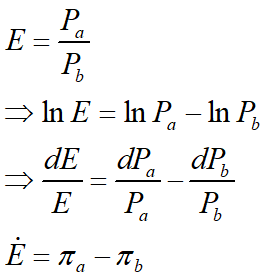

## 汇率决定理论

国家借贷说：国际收支
购买力平价说：本国与外国货币购买力之比
汇兑心理说：外币的边际效用
利率平价说：抛补套利和非抛补套利

### 购买力评价说
一价定律：同样的商品在两国的价格相同（同一种货币）
购买力平价说的基本思想：国内外货币之间的汇率由此主要取决于两国货币购买力的比较。 
购买力平价有两种形式：绝对形式（absolute version）与相对形式（relative version）。绝对形式说明的是某一时点上汇率的决定，相对形式说明的是在两个时点间`汇率的变动`。
E = Pa/Pb
汇率调整到购买力平价相等的水平是通过国际商品套购行为实现的。

商品分为贸易品和非贸易品
`!$𝑃_𝑇=𝑆𝑃_{𝑇∗}$`

相对形式

为什么会有相对形式？各国一篮子商品的贬值不同，故价格指数的权重不同，引入价格变动率作为相对形式能有效地消除权重差异的问题。