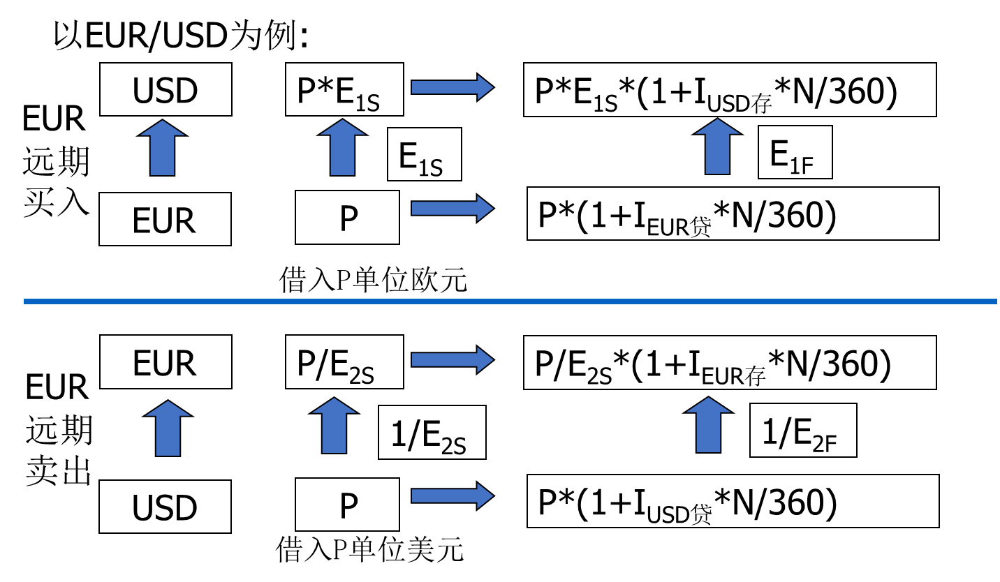

## 外汇和汇率
动态外汇：将一种货币兑换成另一种货币的行为。
静态：是指以外币表示的，可用于清偿国际间债权债务的支付手段。

自由外汇：自由外汇是指在国际外汇市场上可以自由买卖，在国际结算中广泛使用，在国际上可以得到偿付，并可以自由兑换成其他国家货币的外汇。
记账外汇：在两国政府签订的支付协定中所使用的外汇，在一定条件下可以作为两国交往中使用的记账工具。

### 外汇交易
即期外汇交易：两个交易日内交割
标准交割(VAL SP)：T+2
隔日交割(VAL TOM)：T+1
当日交割(VAL TOD)：T+0

NDF(Non-deliverable Forward)无本金交割远期外汇交易
远期只交易汇差，不交割本金
因为某些国家的货币为非自由兑换货币，无法满足交割的需要

远期汇率报价：
汇水前小后大，直接标价升水
回水前大后小，直接标价贴水

carry trade

远期汇率是使swap无套利空间的利率
EUR远期买入——现在空头，远期多头，从而填平头寸——做笔swap——美元多头，远期空头，从而填平头寸——不存在套利空间的远期汇率