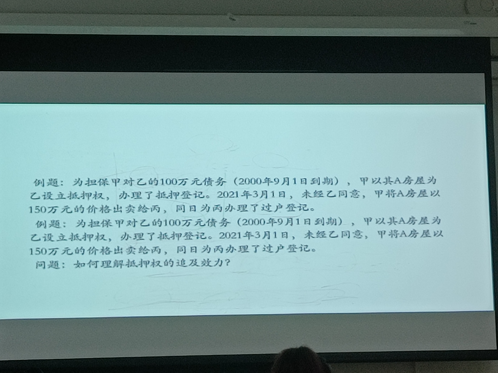

### 抵押权人的权利：处分权
1、抵押权的让与，指抵押权人将其抵押权转让给他人。
  >第四百零七条 【抵押权处分的从属性】`抵押权不得与债权分离而单独转让或者作为其他债权的担保`。债权转让的，担保该债权的抵押权一并转让，但是法律另有规定或者当事人另有约定的除外。`除非特别约定，一般不需要抵押人同意`
（1）抵押权人不得将抵押权单独让与他人，自己保留其主债权。`已经构成抵押权消灭的事由`
（2）抵押权人不得将债权单独让与他人，自己保留抵押权。
（3）抵押权人也不得将债权及抵押权分别让与给不同的人。

>附抵押权的债权质：A向B借100w，以房产抵押，B向C借120w，以对A的债权质押，则抵押要设定担保给C；但不能单独以A房产的抵押权设立担保。

### 保全权
八、抵押权人的权利－－保全权
>《民法典》 第四百零八条 【抵押权的保护】抵押人的行为足以使抵押财产价值减少的，抵押权人有权请求抵押人停止其行为；抵押财产价值减少的，抵押权人有权请求恢复抵押财产的价值，或者提供与减少的价值相应的担保。抵押人不恢复抵押财产的价值，也不提供担保的，抵押权人有权请求债务人提前清偿债务

（1）抵押物价值减少的防止权
抵押物价值减少的防止权，即抵押人的行为（积极行为或消极行为，如将设定抵押权的房屋损毁或应当修缮而不为修缮）有足以使抵押物的价值减少时，抵押权人有要求抵押人停止其行为的权利。
（2）抵押物价值减少的回复原状或增加担保请求权
抵押物价值减少的回复原状或增加担保请求权，即因抵押人的行为致使抵押物的价值实际减少的，抵押权人有要求抵押人恢复原状或增加担保的权利。请求恢复抵押财产的价值，或者提供与减少的价值相应的担保。这两种请求权择一行使。

>能否停止第三人的行为？可以，抵押权是物权

### 抵押人的权利：设立多个抵押权
>~~《担保法》第35条：抵押人所担保的债权不得超出其抵押物的价值。~~
 财产抵押后，该财产的价值大于所担保债权的余额部分，可以再次抵押，但不得超出其余额部分。
 《担保法》只允许余额抵押，不允许重复抵押。
《担保法司法解释》第51条：抵押人所担保的债权超出其抵押物价值的，超出的部分不具有优先受偿的效力。（对重复抵押持肯定态度）
《物权法》删去了《担保法》中关于重复抵押的规定。
《民法典》第四百一十四条 【数个抵押权的清偿顺序】同一财产向两个以上债权人抵押的，拍卖、变卖抵押财产所得的价款依照下列规定清偿:《民法典》第四百一十四条第一款 【数个抵押权的清偿顺序】同一财产向两个以上债权人抵押的，拍卖、变卖抵押财产所得的价款依照下列规定清偿:
（一）抵押权已经登记的，按照登记的时间先后确定清偿顺序；`同一天登记视为同一顺序`
（二）抵押权已经登记的先于未登记的受偿；
（三）抵押权未登记的，按照债权比例清偿。

>棒球仲裁模式：
仲裁双方各自给出一份仲裁意见，仲裁庭选择一份妥协度更高的仲裁意见作为仲裁结构

### 出租抵押物
2．出租抵押物的权利
>《担保法》第48条：抵押人将已出租的财产抵押的，应当书面告知承租人，原租赁合同继续有效。《担保法司法解释》
  第66条：抵押人将已抵押的财产出租的，抵押权实现后，租赁合同对受让人不具有约束力。抵押人将已抵押的财产出租时，如果抵押人未书面告知承租人该财产已抵押的，抵押人对出租抵押物造成承租人的损失承担赔偿责任；如果抵押人已书面告知承租人该财产已抵押的，抵押权实现造成承租人的损失，由承租人自己承担。`抵押权不优先于租赁`
《物权法》第一百九十条　订立抵押合同前抵押财产已出租的，原租赁关系不受该抵押权的影响。`先租后抵`抵押权设立后抵押财产出租的，该租赁关系不得对抗已登记的抵押权。
《民法典》第四百零五条 【抵押权与租赁权的关系】抵押权设立前，抵押财产已经出租并转移占有的，原租赁关系不受该抵押权的影响。  
  第七百二十五条 【所有权变动不破租赁】租赁物在承租人按照租赁合同占有期限内发生所有权变动的，不影响租赁合同的效力。`买卖不破租赁`
  `租赁为什么不是用益物权而是债权，都具有使用占有而不能处分的特点？用益物权需要登记，租赁不需要登记`
  
### 追偿权

### 转让抵押物

 4．转让抵押物的权利
 >《担保法》第49条：抵押期间，抵押人转让已办理登记的抵押物的，应当通知抵押权人并告知受让人转让物已经抵押的情况；抵押人未`通知`抵押权人或者未告知受让人的，转让行为无效。`不需要同意`
 转让抵押物的价款明显低于其价值的，抵押权人可以要求抵押人提供相应的担保；抵押人不提供的，不得转让抵押物。
抵押人转让抵押物所得的价款，应当向抵押权人提前清偿所担保的债权或者向与抵押权人约定的第三人提存。超过债权数额的部分，归抵押人所有，不足部分由债务人清偿。
《担保法司法解释》第67条： 抵押权存续期间，抵押人转让抵押物未通知抵押权人或者未告知受让人的，如果抵押物已经登记的，抵押权人仍可以行使抵押权；取得抵押物所有权的受让人，可以代替债务人清偿其全部债务，使抵押权消灭。受让人清偿债务后可以向抵押人追偿。
 如果抵押物未经登记的，抵押权不得对抗受让人，因此给抵押权人造成损失的，由抵押人承担赔偿责任。
 《物权法》第191条：
        抵押期间，抵押人经抵押权人同意转让抵押财产的，应当将转让所得的价款向抵押权人提前清偿债务或者提存。转让的价款超过债权数额的部分归抵押人所有，不足部分由债务人清偿。  抵押期间，抵押人未经抵押权人同意，不得转让抵押财产，但受让人代为清偿债务消灭抵押权的除外。`最严格`
《民法典》第四百零六条 【抵押财产的处分】抵押期间，抵押人可以转让抵押财产。当事人另有约定的，按照其约定。抵押财产转让的，抵押权不受影响。`通知是主合同义务还是附随义务？有争议，是效力性规定还是管理性规定`
  抵押人转让抵押财产的，应当及时通知抵押权人。抵押权人能够证明抵押财产转让可能损害抵押权的，可以请求抵押人将转让所得的价款向抵押权人提前清偿债务或者提存。转让的价款超过债权数额的部分归抵押人所有，不足部分由债务人清偿。
   2020年《民法典担保制度司法解释》第四十三条  当事人约定禁止或者限制转让抵押财产`但是未将约定登记`，抵押人违反约定转让抵押财产，抵押权人请求确认转让合同无效的，人民法院不予支持；抵押财产已经交付或者`登记`，抵押权人请求确认转让不发生`物权效力`的，人民法院不予支持，但是抵押权人有证据证明受让人知道的除外`善意相对人的问题，但规定不妥当，因为债权的约定没有公示制度，第三人没有理由知道他们的约定`；抵押权人请求抵押人承担违约责任的，人民法院依法予以支持。
  当事人约定禁止或者限制转让抵押财产且已经将约定登记，抵押人违反约定转让抵押财产，抵押权人请求确认转让合同无效的，人民法院不予支持；抵押财产已经交付或者登记，抵押权人主张转让不发生物权效力的，人民法院应予支持，但是因受让人代替债务人清偿债务导致抵押权消灭的除外。`合同的效力和物权转移的效力要注意！因为无权处分的合同有效，只是承担赔偿责任`
  

>例：转移有效，但甲仍对房屋享有抵押权。除非丙行使涤除权

### 抵押权的实现
九、 抵押权的实现
  > 《民法典》第四百一十条 【抵押权的实现】债务人不履行到期债务或者发生当事人约定的实现抵押权的情形，抵押权人可以与抵押人协议以抵押财产折价或者以拍卖、变卖该抵押财产所得的价款优先受偿。协议损害其他债权人利益的，其他债权人可以请求人民法院撤销该协议。
 抵押权人与抵押人未就抵押权实现方式达成协议的，抵押权人可以请求人民法院拍卖、变卖抵押财产。`不像物权法需要诉讼，直接认定物权有效`
 抵押财产折价或者变卖的，应当参照市场价格。
 
《民法典担保制度司法解释》第四十五条  当事人约定当债务人不履行到期债务或者发生当事人约定的实现担保物权的情形,担保物权人有权将担保财产自行拍卖、变卖并就所得的价款优先受偿的，该约定有效。因担保人的原因导致担保物权人无法自行对担保财产进行拍卖、变卖，担保物权人请求担保人承担因此增加的费用的，人民法院应予支持。
 当事人依照民事诉讼法有关“实现担保物权案件”的规定，申请拍卖、变卖担保财产，被申请人以担保合同约定仲裁条款为由主张驳回申请的，人民法院经审查后，应当按照以下情形分别处理： （一）当事人对担保物权无实质性争议且实现担保物权条件已经成就的，应当裁定准许拍卖、变卖担保财产；
（二）当事人对实现担保物权有部分实质性争议的，可以就无争议的部分裁定准许拍卖、变卖担保财产，并告知可以就有争议的部分申请仲裁；
（三）当事人对实现担保物权有实质性争议的，裁定驳回申请，并告知可以向仲裁机构申请仲裁。
　债权人以诉讼方式行使担保物权的，应当以债务人和担保人作为共同被告。
 
 
 
### 抵押权的消灭
抵押权系属担保物权，因此，物权的一般消灭原因，如混同、抛弃等，担保物权的一般消灭原因，如主债权的消灭、标的物的灭失等，对抵押权均适用。此外，抵押权消灭的原因尚包括如下特殊情形：
（一）抵押权因抵押物的灭失而消灭
（二）抵押权因主债权诉讼时效期间经过而消灭
（三）抵押权人抛弃
（四）抵押权混同
