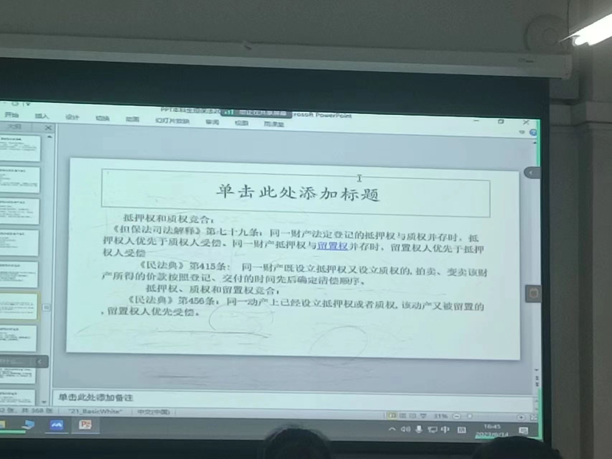

典权和质权
营业质押——典当行
   >法律条文：《民法典》第四百二十五条 【动产质权的定义】为担保债务的履行，债务人或者第三人将其动产出质给债权人占有的，债务人不履行到期债务或者发生当事人约定的实现质权的情形，债权人有权就该动产优先受偿。

   定义：质权，是指债权人在债务人不清偿其债务或发生当事人约定的情形时，可以就债务人或第三人移转占有而供担保的动产或权利卖得价金优先受偿的权利。享有质权的债权人称为质权人，将财产移转给质权人占有而供作担保的债务人或第三人称为出质人；出质人移转给债权人占有以供债权担保的财产，称为质物或质押物。
   

特征：
1．质权是为了担保债权实现而产生的担保物权。
2．质权是在债务人或第三人提供的特定财产上设定的担保物权。
3．质权的标的为动产与某些权利`财产权、可以让与的`。`基于特定信用关系的，交付请求；基于人身权利，；不作为的权利；从权利`
4．质权以移转标的物的占有或者登记为生效要件的物权。`质权的生效标志：转移占有，股权等，登记`
5．质权属于兼具留置效力与优先受偿效力的担保物权。

分类：
1、动产质权、不动产质权与权利质权
2．占有质权、收益质权与归属质权
3．民事质权、商事质权与营业质权

动产质权，指因担保债权，占有由债务人或第三人移交的动产，当债务人不履行债务或发生当事人约定的情形时，可以就动产卖得价金优先受清偿的权利。

动产质权的标的物： 第四百二十六条 【禁止质押的动产范围】法律、行政法规禁止转让的动产不得出质。

>问题：货币可否为质押财产？
>货币是特殊的动产，占有推定为所有，别人抢你钱，你享有的权利为债权
>一般不能。钱封闭到箱子里，设立质押，可以；银行卡？不行，可以挂失

第四百二十八条 【流质】质权人在债务履行期限届满前，与出质人约定债务人不履行到期债务时质押财产归债权人所有的，只能依法就质押财产优先受偿。
 第四百二十九条 【质权生效时间】质权自出质人交付质押财产时设立。

>问题：动产质权的善意取得
《担保法司法解释》第八十四条：出质人以其不具有所有权但合法占有的动产出质的，不知出质人无处分权的质权人行使质权后，因此给动产所有人造成损失的，由出质人承担赔偿责任。`甲把财产交给乙保管，乙以其财产设定质押给丙，丙对财产善意取得，但乙属于无权处分`

第四，转质权
第四百三十四条 【责任转质】质权人在质权存续期间，未经出质人同意转质，造成质押财产毁损、灭失的，应当承担赔偿责任。`不承认责任转质`
【承诺转质】经过出质人同意的质押有效
>时间问题，质押到期时间不一致
>甲——乙——丙
>后面的质权先到期？承诺转质下，可以实现质权，因为出质人同意了
>前面的质权先到期？押品拍卖后，扣除提存转质的债权额后，对剩余部分实现乙的质权，转质权更优先！

第五、抛弃质权
第四百三十五条 【质权的放弃】质权人可以放弃质权。债务人以自己的财产出质，质权人放弃该质权的，其他担保人在质权人丧失优先受偿权益的范围内免除担保责任，但是其他担保人承诺仍然提供担保的除外。

### 权利质权
权利质权，指以所有权以外可以让与的财产权为标的而成立的质权。
1．权利质权以可以让与的债权或其他权利为标的物的质权。
（1）须为财产权。（2）须可让与的财产权。下列不能让与的债权或者其他权利不能为权利质权的标的：第一，基于权利义务关系人之间的特殊信任关系产生的债权。借用关系中的借用物使用权；承揽关系中定作人和承揽人之间形成的加工物品交付请求权。第二，因特定身份为基础的特殊权利。如抚养赡养权。第三，不作为的权利。如以有价证券形式表示的飞机票等。第四，从权利。（3）适合出质的权利。

可以设定权利质权的权利有：（1）债权。因债权具有变现的功能，且具有特定性，特别是具有权利凭证的债权可以作为权利质权的标的。（2）可以转让的基金份额、公司股权。公司股权虽为社员权，但具有经济价值，同时可以转让，故可以成为质权的标的。（3）知识产权中的财产权。（4）依法可以出质的其他权利。
第四百四十条 【权利质权的范围】债务人或者第三人有权处分的下列权利可以出质:（一）汇票、本票、支票；（二）债券、存款单；（三）仓单、提单；（四）可以转让的基金份额、股权；（五）可以转让的注册商标专用权、专利权、著作权等知识产权中的财产权；（六）现有的以及将有的应收账款；（七）法律、行政法规规定可以出质的其他财产权利。

### 留置权
留置权，是指债权人在债务人不履行债务时，对其占有的债务人的动产予以留置，并以该动产折价或者以拍卖、变卖该动产的价款优先受偿的权利。
特征：`以一定的法律关系成立`
1．留置权为法定担保物权。
2．留置权为于债权未受清偿时，得留置他人动产的担保物权。
3．留置权是在法定条件下留置他人动产的担保物权。

>留置权的成立条件
 第四百四十七条 【留置权的定义】债务人不履行到期债务，债权人可以留置已经合法占有的债务人的动产，并有权就该动产优先受偿。
前款规定的债权人为留置权人，占有的动产为留置财产。
第四百四十八条 【留置财产与债权的关系】债权人留置的动产，应当与债权属于同一法律关系，但是企业之间留置的除外。
《担保法司法解释》第一百零八条：债权人合法占有债务人交付的动产时，不知债务人无处分该动产的权利，债权人可以按照担保法第八十二条的规定行使留置权。

建筑工程款优先受偿权 法定抵押权`类比留置权`

1. 必须为动产
2. 留置的动产必须和留置权有同一关系 承揽合同 运输合同 保管合同 没有同一法律关系不产生留置权
> 侵权行为成立留置权吗？不成立，没有同一法律关系
> 踢球打碎花瓶，被侵权方留置球，不成立留置权

>问题：不具有成立留置权的消极事由有哪些？
因侵权行为而占有
甲交给乙保管物品，甲没有支付保管费，此时乙有留置权，但约定乙有义务把丙交付给丙，这样乙就不能行使留置权（法定：对甲的留置权，约定：交付给丙，和合同的约定冲突）
甲交给乙10匹布制作衣服，但只支付了1/3的价款，乙能留置义务，但不能留置布匹本身

### 担保物权的竞存 （变迁考！！）
《担保法司法解释》79条

担保物权的竞存（《民法典》第415、416、456条，《九民纪要》第65条）
 《民法典》第415条: 同一财产既设立抵押权又设立质权的,拍卖、变卖该财产所得的价款按照登记、交付的时间先后确定清偿顺序。 
 第416条： 动产抵押担保的主债权是抵押物的价款,标的物交付后十日内办理抵押登记的,该抵押权人优先于抵押物买受人的其他担保物权人受偿,但是留置权人除外。 
第456条：同一动产上已经设立抵押权或者质权,该动产又被留置的,留置权人优先受偿。

####   2、质权、抵押权相互之间（主要限于动产）
  （1）质权有效设立、抵押权办理了抵押登记的，按照公示（交付、登记）先后确定清偿顺序；顺序相同的，按照债权比例清偿。
    《民法典》第415条: 同一财产既设立抵押权又设立质权的,拍卖、变卖该财产所得的价款按照登记、交付的时间先后确定清偿顺序。

《九民纪要》65.【动产抵押权与质权竞存】同一动产上同时设立质权和抵押权的，应当参照适用《物权法》第199条的规定，根据是否完成公示以及公示先后情况来确定清偿顺序：质权有效设立、抵押权办理了抵押登记的，按照公示先后确定清偿顺序；顺序相同的，按照债权比例清偿；质权有效设立，抵押权未办理抵押登记的，质权优先于抵押权；质权未有效设立，抵押权未办理抵押登记的，因此时抵押权已经有效设立，故抵押权优先受偿。

>1. 担保法司法解释 抵押优先
>2. 民法典 登记和交付顺序
>3. 甲设定抵押给乙，没有登记，又设定质权给丙，没有交付，哪一个优先？
>交付了，质权优先；没有交付，抵押优先（质权没有设立，因为没有设立生效，但抵押设立了，只是不能对抗第三人）

#### 留置权与质权、抵押权之间。
  （1）先设立质权或抵押权，后成立留置权。
> 例题：甲将其A车抵押给乙，办理了抵押登记。后甲将A车交给丙修理，因甲不支付到期修理费，丙将A车留置。
> `留置优先`
 
（2）先设立留置权、后设立质权或抵押权。

 >例题：甲将其A车送乙修理，因甲不支付到期修理费，乙留置A车。此后，所有权人甲又将该A车抵押给丙。
 >`留置权优先`
  例题：甲将A车送给乙修理，因甲不支付到期修理费，乙留置A车。因留置权人乙需为丙提供担保，经甲同意后，乙以自己的名义将A车出质给丙，并完成现实交付。
  `质权优先，乙让渡了自己的留置权。核心是留置权是谁设立的！承诺转质`

概念题 5分  4题
一般保证和连带责任保证 先诉抗辩权
保证是从属性的关系，代位追偿权 代位+追偿
动词浮动抵押 两个新的制度

简答题 2道 10分
抵押物的转让

案例分析题 15分
动产抵押 浮动抵押 登记对抗， 各种规则

论述题 25题
人保 物保
内部追偿权 真正连带和不真正连带 民法典 13条

