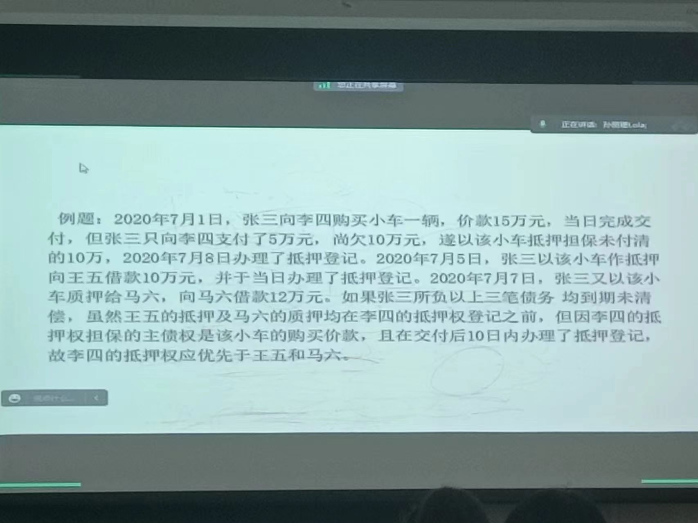

### 动产抵押权
>《担保法》第四十三条 当事人以其他财产抵押的,可以自愿办理抵押物登记,抵押合同自签订之日起生效。 
当事人未办理抵押物登记的,不得对抗第三人。当事人办理抵押物登记的,登记部门为抵押人所在 地的公证部门。 
《物权法》第一百八十八条　以本法第一百八十条第一款第四项、第六项规定的财产或者第五项规定的正在建造的船舶、航空器抵押的，抵押权自抵押合同生效时设立；未经登记，不得对抗善意第三人。
《物权法》第一百八十九条　企业、个体工商户、农业生产经营者以本法第一百八十一条规定的动产抵押的，应当向抵押人住所地的工商行政管理部门办理登记。抵押权自抵押合同生效时设立；未经登记，不得对抗善意第三人。
 依照本法第一百八十一条规定抵押的，不得对抗正常经营活动中已支付合理价款并取得抵押财产的买受人。
《民法典》第四百零三条 【动产抵押的效力】以动产抵押的，抵押权自抵押合同生效时设立；未经登记，不得对抗善意第三人。
 第四百零四条 【动产抵押权无追及效力】以动产抵押的，不得对抗正常经营活动中已经支付合理价款并取得抵押财产的买受人。  
 
 
动产抵押，是指债权人对于债务人或第三人`不转移占有`而提供作为履行债务担保的动产，在债务人不履行到期债务时或者发生当事人约定的实现抵押权的情形，债权人有权就该财产优先受偿。
>问题：动产抵押权的效力，为何采纳“登记对抗主义”？
成本太高，阻碍交易进行
动产占有推定为所有，买受人没有义务去查询公示，公示制度和动产买卖相违背

>问题：如何理解《民法典》第403条“不得对抗善意第三人”？
买受人
不能对抗其他抵押权人，因为抵押权存在顺序
先租后抵，不能；先抵后租，能

>问题：未登记的动产抵押权能否对抗一般债权人？
>丁买甲的车但没有交付,甲和丁就形成了一般债权人,可以,有抵押担保的债权对抗一般债权,物权优先于债权
>`一般债权人项法院申请扣押的除外`
>《民法典担保制度司法解释》第五十四条  动产抵押合同订立后未办理抵押登记，动产抵押权的效力按照下列情形分别处理：
（一）抵押人转让抵押财产，受让人占有抵押财产后，抵押权人向受让人请求行使抵押权的，人民法院不予支持，但是抵押权人能够举证证明受让人知道或者应当知道已经订立抵押合同的除外；      
（二）抵押人将抵押财产出租给他人并移转占有，抵押权人行使抵押权的，租赁关系不受影响，但是抵押权人能够举证证明承租人知道或者应当知道已经订立抵押合同的除外；
（三）抵押人的其他债权人向人民法院申请保全或者执行抵押财产，人民法院已经作出财产保全裁定或者采取执行措施，抵押权人主张对抵押财产优先受偿的，人民法院不予支持；
（四）抵押人破产，抵押权人主张对抵押财产优先受偿的，人民法院不予支持。

>问题：如何理解《民法典》第404条“正常经营活动中的买受人规则”？
正常经营活动针对的出卖人还是买受人,还是都有?
①指出卖人从事正常经营活动,买卖行为在经营许可之内; ②买受人支付合理的价款,否则有恶意串通的故意; ③买受人取得抵押财产,防止恶意串通,应以现实交付为准;④ 买受人须构成善意,买受人没有查询是否登记的义务
对善意的程度要求低
>《新担保法司法解释》第五十六条  买受人在出卖人正常经营活动中通过支付合理对价取得已被设立担保物权的动产，担保物权人请求就该动产优先受偿的，人民法院不予支持，但是有下列情形之一的除外：  
  （一）购买商品的数量明显超过一般买受人；
（二）购买出卖人的生产设备；
（三）订立买卖合同的目的在于担保出卖人或者第三人履行债务；  
（四）买受人与出卖人存在直接或者间接的控制关系；
（五）买受人应当查询抵押登记而未查询的其他情形。`不合理`
前款所称出卖人正常经营活动，是指出卖人的经营活动属于其营业执照明确记载的经营范围，且出卖人持续销售同类商品。前款所称担保物权人，是指已经办理登记的抵押权人、所有权保留买卖的出卖人、融资租赁合同的出租人。

>正常经营活动的买受人规则下,买卖行为的法律效力如何?抵押物的上的抵押权消灭了吗?
>孳息归所有人

 >问题：《民法典》第403条与第404条的关系？
 第四百零三条 【动产抵押的效力】以动产抵押的，抵押权自抵押合同生效时设立；未经登记，不得对抗善意第三人。
 第四百零四条 【动产抵押权无追及效力】以动产抵押的，不得对抗正常经营活动中已经支付合理价款并取得抵押财产的买受人。`优先适用404,403对善意的要求高`
 
 >问题：《民法典》第404条与第406条的关系如何？
  第四百零四条 【动产抵押权无追及效力】以动产抵押的，不得对抗正常经营活动中已经支付合理价款并取得抵押财产的买受人。
 第四百零六条 【抵押财产的处分】抵押期间，抵押人可以转让抵押财产。当事人另有约定的，按照其约定。抵押财产转让的，抵押权不受影响。
 抵押人转让抵押财产的，应当及时通知抵押权人。抵押权人能够证明抵押财产转让可能损害抵押权的，可以请求抵押人将转让所得的价款向抵押权人提前清偿债务或者提存。转让的价款超过债权数额的部分归抵押人所有，不足部分由债务人清偿。`每次正常经营活动中的转移都要通知吗?不用`
 
 
## 超级动产抵押(价金超级优先权)
>《民法典》第四百一十六条 【动产购买价款抵押担保的优先权】动产抵押担保的主债权是抵押物的价款，标的物交付后`十日`内办理抵押登记的，该抵押权人优先于抵押物买受人的其他担保物权人受偿，但是留置权人除外。
《民法典担保制度解释》第五十七条：担保人在设立动产浮动抵押并办理抵押登记后又购入或者以融资租赁方式承租新的动产，下列权利人为担保价款债权或者租金的实现而订立担保合同，并在该动产交付后十日内办理登记，主张其权利优先于在先设立的浮动抵押权的，人民法院应予支持：（一）在该动产上设立抵押权或者保留所有权的出卖人；（二）为价款支付提供融资而在该动产上设立抵押权的债权人；（三）以融资租赁方式出租该动产的出租人。
买受人取得动产但未付清价款或者承租人以融资租赁方式占有租赁物但是未付清全部租金，又以标的物为他人设立担保物权，前款所列权利人为担保价款债权或者租金的实现而订立担保合同，并在该动产交付后十日内办理登记，主张其权利优先于买受人为他人设立的担保物权的，人民法院应予支持。

民法典第416条规定是新增的重要规则，被称为价款优先权或者价款超级优先权。
问题：《民法典》第416条的立法趣旨是什么？
构成要件：
1.担保的内容必须是此货物的货款；
2.一定要去做抵押登记，否则不但不能设立抵押权，还有可能被第三人善意取得；
3.一定要在交货后的十日内去办理抵押登记，如果过了这个期间，也不能设立此抵押权。
例外：超级动产抵押权不能对抗留置权。

甲赊购丙的100w货物,甲又向丁银行借款借款100w清偿应付账款,丁可以以100w的货物设定价金超级优先权

两个相同的价金超级优先权之间,存在抵押顺序

## 浮动抵押(floating charge)
>
第三百九十六条 【浮动抵押】企业、个体工商户、农业生产经营者可以将`现有`的以及`将有`的生产设备、原材料、半成品、产品抵押，债务人不履行到期债务或者发生当事人约定的实现抵押权的情形，债权人有权就抵押财产确定时的动产优先受偿。`自然人不行` `抵押物进出自由,出去抵押权消灭,进来不用登记自动设立抵押` `浮动抵押下,集合物才能抵押`
第四百零三条 【动产抵押的效力】以动产抵押的，抵押权自抵押合同生效时设立；未经登记，不得对抗善意第三人。
	第四百一十一条 【浮动抵押财产的确定】依据本法第三百九十六条规定设定抵押的，抵押财产自下列情形之一发生时确定:
 （一）债务履行期限届满，债权未实现；
  （二）抵押人被宣告破产或者解散；
  （三）当事人约定的实现抵押权的情形；
  （四）严重影响债权实现的其他情形。

动产浮动抵押，指抵押人以其现有或将有的动产设立抵押，抵押设立后，抵押人仍然有权在正常经营活动中处置其抵押财产，仅在特定的事项发生后，抵押财产特定，抵押权人仅能就特定的抵押财产优先受偿的动产抵押制度。
2．特征
（1）担保财产的集合性。`动产浮动抵押是一物一权原则的例外`，其抵押财产是经营者所有的集合动产，包括经营者现有或将有的生产设备、原材料、半成品、产品。
（2）主体的特定性。抵押人限于企业、个体工商户、农业生产经营者。未从事生产经营的“自然人”不能设立此种抵押权。
（3）抵押财产的不确定性。①动产浮动抵押设立之初，抵押财产并未特定化，包括“现有”和“将有”的财产；②抵押财产具有变动性。③在《物权法》第196条规定的事由发生时，抵押财产特定化。
（4）抵押财产的可处分性。抵押期间，抵押人“可以不经抵押权人的允许”，在正常的经营活动中对抵押物进行处分。抵押财产一经处分就“自动解除抵押”，不再属于抵押财产。
（5）抵押权的效力具有“休眠期”。浮动抵押的休眠，指在抵押财产特定前，抵押权人没有支配具体抵押财产的权利，无权禁止抵押人在正常的经营范围内处分抵押财产，除非抵押合同另有约定。

3．浮动抵押的优点
（1）浮动抵押，能充分发挥企业的担保价值，企业因此可以聚集到数额巨大的资金。
（2）浮动抵押设定手续十分便捷。
（3）就企业财产设定浮动抵押，对于企业的经营活动也无妨害。
（4）通常情形，浮动抵押权人都能从企业的收益中使自己的债权获得完全清偿。

3、动产浮动抵押的设立
第四百零三条 【动产抵押的效力】以动产抵押的，抵押权自抵押合同生效时设立；未经登记，不得对抗善意第三人。
（1）动产浮动抵押权自抵押合同生效时设立；未经登记，不得对抗善意第三人。是否登记，当事人自主决定。
2．即使登记，不得对抗正常经营活动中已支付合理价款并取得抵押财产的买受人。

 （四）动产浮动抵押权休眠期结束的情形：抵押动产确定（结晶）(crystalize)
  1、债务履行期限届满，债权未实现；
  2、抵押人被宣告破产或者解散；
  3、当事人约定的实现抵押权的情形；
  4、严重影响债权实现的其他情形。
所谓“结晶”，又称为封押或者冻结。按照浮动抵押理论模型，浮动抵押设定时需要高度尊重抵押人在正常生产经营过程中的经营权，因此，只需要对“浮动”抵押物给予概括性描述即可，不需要制作包括抵押物的名称、数量、质量等在内的财产目录；而在债务人不履行到期债务等情形发生时，浮动抵押变为固定抵押，需对进行变更登记，此时才需要将所谓的“浮动抵押”财产造簿注册，制作财产清单。

>问题：浮动抵押与财团抵押 
>大陆法系的制度 `财团抵押` 有财产名录,不能随意进出
问题：动产浮动抵押权与《民法典》第404条
例题：甲公司的主营业务为制造挖掘机。为担保甲公司对乙要回负担的1000万元借款债务（2020年9月1日到期），甲以其动产为乙设立动产浮动抵押权，办理了抵押登记。2020年6月1日，甲将其制造的A挖掘机以市场价出卖给丙并交付。2020年11月1日，甲将其制造的B挖掘机以市价出卖给丁并交付。因甲到期不能履行1000万元借款债务，2020年12月1日，乙行使对甲财产的动产浮动抵押权。问如何实现抵押权？

>在浮动抵押范围内的财产能否设立抵押?设立抵押的顺序如何?
>可以,举重以明轻 有处分权
>固定的抵押优先

### 最高额抵押权
 最高额抵押是指债务人或者第三人对一定期间内将要连续发生的债权提供担保财产的，债务人不履行到期债务或者发生当事人约定的实现抵押权的情形，抵押权人有权在最高债权额限度内就该担保财产优先受 偿。
 `连续的供货关系，设定抵押，还款了之后又设定抵押。经常的往来关系设定抵押费时费力，预估一个最高额的限额，然后每次借款不需要设定抵押` 最高额保证、质押、抵押
1．最高额抵押权的特征
（1）最高额抵押权，不仅其债权的发生是在`将来`，而且债权的具体数额在设定最高额抵押权时也`未确定`。
（2）预定最高限额。
这是最高额抵押权的重要特征。所谓最高限额，是指抵押权人基于最高额抵押权可以优先受偿债权的最高数额。`超过部分为无抵押普通债权`
（3）最高额抵押权是一种特殊的抵押权：第一，最高额抵押的设定，无须先有债权的存在。第二，在最高额抵押权存续期间，已发生的债权，纵已消灭，抵押权也不随同消灭。第三，最高额抵押权未定存续期间的，抵押权可以随时通知债权人终止抵押合同。第四，最高额抵押有决算期`浮动抵押的结晶`。第五，最高额抵押的成立与消灭的从属性放宽。第六，实行最高额抵押权时，以实际发生的债权额为准，超过部分不受担保。
2．最高额抵押权担保的债权的确定
（1）约定的债权确定期间届满。债权确定期间，指确定最高额抵押权所担保的债权实际数额的时间。
（2）没有约定债权确定期间或者约定不明的，我国《民法典》明确规定，抵押权人或者抵押人自最高额抵押权设定之日起满二年后请求确定债权。
（3）新的债权不可能发生。这里的“新的债权不可能发生”主要包括两种情形：一是连续交易的终止。二是最高额抵押关系的基础法律关系消灭导致新的债权不可能发生。
（4）抵押财产被查封、扣押。（5）债务人、抵押人被宣告破产或者被撤销。

>问题：最高额抵押权决算期中的问题
所谓最高额抵押权的决算期，是指法律中所称的“一定期间内”，也即是债权确定的期间。依照我国民法典的规定，最高额抵押权的决算期可以由抵押人和抵押权人在合同中约定，合同没有约定或者约定不明的情形下，抵押人或者抵押权人均可从最高额抵押权设定之日起满二年后请求确定债权。

>甲向乙借款，丙为甲对乙的债务担保，时间2018.1.1-2018.12.31 丙以其办公楼设定最高额抵押
>1）甲对乙的借款合同无效，最高权抵押无效
2）乙以其对甲的债权转让给丁，抵押担保关系一并转让
3）1.1日甲并没有向乙借款，则抵押依然存在
4）1.1日借款，但4.2还清，则最高额抵押权依然存在。
5）甲向乙借款1000w，乙将500w的债权转让给丁，此时最高额抵押权 民法典421 不转让 另有约定除外
6）决算期外的债务，不在最高额抵押权范围内

>4、问题：最高限额的变更转让
《担保法司法解释》第83条第2款：抵押权人实现最高额抵押权时，如果实际发生的债权余额高于最高限额的，以最高限额为限，超过部分不具有优先受偿的效力；如果实际发生的债权余额低于最高限额的，以实际发生的债权余额为限对抵押物优先受偿。
最高额抵押合同的变更：
《民法典》第422条：最高额抵押担保的债权确定前，抵押权人与抵押人可以通过协议变更债权确定的期间、债权范围以及最高债权额。但是，变更的内容不得对其他抵押权人产生不利影响。
最高额抵押权的转让：
第四百二十二条 【最高额抵押合同条款变更】最高额抵押担保的债权确定前，抵押权人与抵押人可以通过协议变更债权确定的期间、债权范围以及最高债权额。但是，变更的内容不得对其他抵押权人产生不利影响。

### 人保和物保并存时的担保规则(考！！！)
规定不同，内部追偿权 一般连带责任和。。。
真正连带责任

>《担保法》第二十八条 同一债权既有保证又有物的担保的，保证人对物的担保以外的债权承担保证责任。
债权人放弃物的担保的，`保证人在债权人放弃权利的范围内免除保证责任。`
《担保法司法解释》第三十八条第一款：同一债权既有保证又有第三人提供物的担保的，债权人可以请求保证人或者物的担保人承担担保责任。当事人对保证担保的范围或者物的担保的范围没有约定或者约定不明的，承担了担保责任的担保人，可以向债务人追偿，也可以要求其他担保人清偿其应当分担的份额。
《物权法》第176条：被担保的债权既有物的担保又有人的担保的，债务人不履行到期债务或者发生当事人约定的实现担保物权的情形，债权人应当按照约定实现债权；没有约定或者约定不明确，债务人自己提供物的担保的，债权人应当先就该物的担保实现债权；第三人提供物的担保的，债权人可以就物的担保实现债权，也可以要求保证人承担保证责任。提供担保的第三人承担担保责任后，有权向债务人追偿。
《民法典第三百九十二条》 【人保和物保并存时担保权的实行规则】被担保的债权既有物的担保又有人的担保的，债务人不履行到期债务或者发生当事人约定的实现担保物权的情形，债权人应当按照约定实现债权；没有约定或者约定不明确，债务人自己提供物的担保的，债权人应当先就该物的担保实现债权；第三人提供物的担保的，债权人可以就物的担保实现债权，也可以请求保证人承担保证责任。提供担保的第三人承担担保责任后，有权向债务人追偿。`人保和物保的地位相同`
《民法典担保制度司法解释》第十三条  同一债务有两个以上第三人提供担保，担保人之间约定相互追偿及分担份额，承担了担保责任的担保人请求其他担保人按照约定分担份额的，人民法院应予支持；担保人之间约定承担连带共同担保，或者约定相互追偿但是未约定分担份额的，各担保人按照比例分担向债务人不能追偿的部分。（重要！！）
  同一债务有两个以上第三人提供担保，担保人之间未对相互追偿作出约定且未约定承担连带共同担保，但是各担保人在同一份合同书上签字、盖章或者按指印，承担了担保责任的担保人请求其他担保人按照比例分担向债务人不能追偿部分的，人民法院应予支持  
除前两款规定的情形外，承担了担保责任的担保人请求其他担保人分担向债务人不能追偿部分的，人民法院不予支持。
 《民法典担保制度司法解释》第十四条  同一债务有两个以上第三人提供担保，担保人受让债权的，人民法院应当认定该行为系承担担保责任。受让债权的担保人作为债权人请求其他担保人承担担保责任的，人民法院不予支持；该担保人请求其他担保人分担相应份额的，依照本解释第十三条的规定处理。
 
1、有约定的，按约定。
2、没有约定的，按照下列规则行使：
（1）债务人以自己的财产提供物保的，债权人应当先就该物的担保实现债权。债权人未对债务人以其财产提供的物保行使担保物权，即请求提供担保的第三人就全部债权承担担保责任，第三人可主张对债务人以其财产提供物保担保的债权部分不承担担保责任。
（2）债务人以外的第三人提供物保和人保的，提供物保和保证的第三人地位平等。债权人既可以要求保证人承担保证责任，又可以要求物上保证人承担担保责任。

 
 
 >问题：提供担保的第三人承担担保责任后，除有权向债务人追偿外，是否有权向其他担保人追偿？
 根据《民法典担保制度司法解释》第十三条的规定，担保人之间是否有相互追偿权按以下规则办理：
第一， 担保人之间约定相互追偿及分担份额，可以按照约定相互追偿。
第二，担保人之间约定承担连带共同担保，或者约定相互追偿但是未约定分担份额的，各担保人可以相互追偿，但必须按照比例分担向债务人不能追偿的部分。
 第三，担保人之间未对相互追偿作出约定且未约定承担连带共同担保，但是各担保人在同一份合同书上签字、盖章或者按指印，承担了担保责任的担保人可以请求其他担保人按照比例分担向债务人不能追偿部分。  

