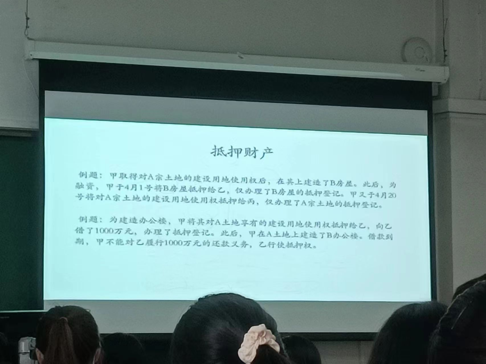

### 五、抵押财产

 >《民法典》第三百九十五条 【抵押财产的范围】债务人或者第三人有权处分的下列财产可以抵押:
（一）建筑物和其他土地附着物；
（二）建设用地使用权；
（三）海域使用权；
（四）生产设备、原材料、半成品、产品；
（五）正在建造的建筑物、船舶、航空器；
（六）交通运输工具；
（七）法律、行政法规未禁止抵押的其他财产。
抵押人可以将前款所列财产一并抵押。

正面要求：
第一，须是具有独立交换价值且法律允许转让的财产。
**问题：限制流通的财产，是否可以设定抵押权？**`可以`
>第五条
以法律、法规禁止流通的财产或者不可转让的财产设定担保的，担保合同无效。以法律、法规限制流通的财产设定担保的，在实现债权时，人民法院应当按照有关法律、法规的规定对该财产进行处理。

第二，须是权属明晰且抵押人有权处分的财产。
权属不明晰的财产主要包括：①处于继承程序中的遗产、②对权属有争议的财产、③处于国家强制力控制下的财产（如被查封、扣押、监管的财产）
问题：不动产抵押权的善意取得
>第三百一十一条：【善意取得】无处分权人将不动产或者动产转让给受让人的，所有权人有权追回；除法律另有规定外，符合下列情形的，受让人取得该不动产或者动产的所有权： （一）受让人受让该不动产或者动产时是善意； （二）以合理的价格转让； （三）转让的不动产或者动产依照法律规定应当登记的已经登记，不需要登记的已经交付给受让人。 受让人依据前款规定取得不动产或者动产的所有权的，原所有权人有权向无处分权人请求损害赔偿。 当事人善意取得其他物权的，参照适用前两款规定。

第三，须是宜于由抵押人占有使用且符合社会公共利益的财产。

（1）可以作为抵押权标的财产有：
ａ．建筑物和其他土地附着物。`林木、庄稼`

 **问题：以违法建筑物抵押的效力如何？**
 >小产权房：在集体土地上的商品房
 >违法建筑物：没有取得国有土地使用权，`五证齐全`
 >1、《国有土地使用权证》；
2、《建设用地规划许可证》；
3、《建设工程规划许可证》；
4、《建设工程施工许可证》；
5、《商品房预售许可证》或《商品房销售许可证》
 >抵押合同无效，但一审前取得许可证的除外

Ｂ．建设用地使用权。
**问题：《民法典》第353条规定：“建设用地使用权人有权将建设用地使用权转让、互换、出资、赠与或者抵押，但是法律另有规定的除外”，此处的“法律另有规定”指的是什么？**
**问题：当事人以划拨建设用地使用权抵押的效力如何？**
>《中华人民共和国城市房地产管理法》第三十八条  以划拨方式取得土地使用权的，转让房地产时，应当按照国务院规定，报有批准权的人民政府审批。有批准权的人民政府准予转让的，应当由受让方办理土地使用权出让手续，并依照国家有关规定缴纳土地使用权出让金。
以划拨方式取得土地使用权的，转让房地产报批时，有批准权的人民政府按照国务院规定决定可以不办理土地使用权出让手续的，转让方应当按照国务院规定将转让房地产所获收益中的土地收益上缴国家或者作其他处理。

**问题：房地产抵押权设立时的“房随地走”、“地随房走”规则**
>土地和土地上的房屋是一个不动产还是两个不动产？德国：一个，日本：两个，中国：两个
>允许土地和房屋分开抵押，但实现抵押视为一并抵押
>《民法典》第三百九十七条 【建筑物与建设用地使用权同时抵押规则】以建筑物抵押的，该建筑物占用范围内的建设用地使用权一并抵押。以建设用地使用权抵押的，该土地上的建筑物一并抵押。  
  抵押人未依据前款规定一并抵押的，未抵押的财产`视为一并抵押`。
  第三百九十八条 【乡镇、村企业的建设用地使用权抵押限制】乡镇、村企业的建设用地使用权不得单独抵押。以乡镇、村企业的厂房等建筑物抵押的，其占用范围内的建设用地使用权一并抵押。      
 《城市房地产管理法》第三十二条：房地产转让、抵押时，房屋的所有权和该房屋占用范围内的土地使用权同时转让、抵押。
 
 
**问题：建设用地使用权抵押后，该土地上新增的建筑物是否属于抵押财产。**
> 《民法典》第四百一十七条 【抵押权对新增建筑物的效力】建设用地使用权抵押后，该土地上`新增的建筑物不属于抵押财产`。该建设用地使用权实现抵押权时，应当将该土地上新增的建筑物与建设用地使用权一并处分。但是，新增建筑物所得的价款，抵押权人无权优先受偿。
《民法典担保制度解释》第五十一条  当事人仅以建设用地使用权抵押，债权人主张抵押权的效力及于土地上已有的建筑物以及正在建造的建筑物已完成部分的，人民法院应予支持。债权人主张抵押权的效力及于正在建造的建筑物的续建部分以及新增建筑物的，人民法院不予支持。
当事人以正在建造的建筑物抵押，抵押权的效力范围限于已办理抵押登记的部分。当事人按照担保合同的约定，主张抵押权的效力及于续建部分、新增建筑物以及规划中尚未建造的建筑物的，人民法院不予支持。
抵押人将建设用地使用权、土地上的建筑物或者正在建造的建筑物分别抵押给不同债权人的，人民法院应当根据抵押登记的时间先后确定清偿顺序。

>1. 若届期加不能清偿乙和丙的债务，视为一并抵押，即房屋和土地一并拍卖，按照时间顺序按顺序受偿，顺位和设立抵押的顺序一致。
>2. B办公楼属于新增建筑物，不属于抵押财产，没有优先受偿权，债权人仅能平均受偿

**问题：在当事人仅就建设用地上的建筑物设定抵押的情况下，如果该建筑物所占用的土地面积远小于该宗建设用地，在抵押权人实现抵押权时，能否就该宗建设用地的全部享有优先受偿权？**
>有争议

Ｃ．以招标、拍卖、公开协商等方式取得的荒地等土地承包经营权。`14年土地三权分置`
ｄ．生产设备、原材料、半成品、产品。`动产抵押、浮动抵押`
ｅ．正在建造的建筑物、船舶、航空器。
>问题：何为在建工程抵押？
>对抵押标的物特定性的突破
《民法典》第395条第1款规定，债务人或者第三人有权处分的正在建造的建筑物可以抵押。

问题：房地产开发企业先以其建设用地使用权设定了抵押权，并在土地登记部门办理土地使用权抵押权设立登记，然后又以在建工程设定抵押权。这时房屋登记机构是否能够为其办理在建工程抵押权设立登记? `能`

（2）法律禁止作为抵押权标的财产有：
>依据我国《民法典》的规定，下列财产不得抵押：
第三百九十九条 【禁止抵押的财产范围】下列财产不得抵押:
（一）土地所有权；`效力性强制性规定`
（二）宅基地、自留地、自留山等集体所有土地的使用权，但是法律规定可以抵押的除外；
（三）学校、幼儿园、医疗机构等为公益目的成立的非营利法人的教育设施、医疗卫生设施和其他公益设施；
（四）所有权、使用权不明或者有争议的财产；`管理性强制性规定`
（五）依法被查封、扣押、监管的财产；
（六）法律、行政法规规定不得抵押的其他财产。

**管理性强制性规定与效力性强制性规定的区别是什么？**
>管理性强制性规定与效力性强制性规定的区别如下：
（1）管理性规定是指法律及行政法规未明确规定违反此类规定将导致合同无效的规定；此类规定旨在管理和处罚违反规定的行为，但并不否认该行为在民商法上的效力；
（2）效力性规定是指法律及行政法规明确规定违反该类规定将导致合同无效的规定，或者虽未明确规定违反之后将导致合同无效，但若使合同继续有效将损害国家利益和社会公共利益的规定。

### 抵押权的效力－－抵押权效力及于标的物的范围
>《民法典》第三百八十九条 【担保物权的担保范围】担保物权的担保范围包括主债权及其利息、违约金、损害赔偿金、保管担保财产和实现担保物权的费用。当事人另有约定的，按照其约定。
>2020年《民法典担保制度司法解释》第四十条  从物产生于抵押权依法设立前，抵押权人主张抵押权的效力及于从物的，人民法院应予支持，但是当事人另有约定的除外。
 `从物产生于抵押权依法设立后，抵押权人主张抵押权的效力及于从物的，人民法院不予支持`，但是在抵押权实现时可以一并处分。
 《民法典担保制度司法解释》第四十一条  抵押权依法设立后，抵押财产被添附，添附物归第三人所有，`抵押权人主张抵押权效力及于补偿金的，人民法院应予支持`。  `物上代为性`
  抵押权依法设立后，抵押财产被添附，抵押人对添附物享有所有权，抵押权人主张抵押权的效力及于添附物的，人民法院应予支持，但是添附导致抵押财产价值增加的，抵押权的效力不及于增加的价值部分。
抵押权依法设立后，抵押人与第三人因添附成为添附物的共有人，抵押权人主张抵押权的效力及于抵押人对共有物享有的份额的，人民法院应予支持。
 本条所称添附，包括附合、混合与加工。
 
 ### 抵押权的效力：优先受偿权
优先受偿权是抵押权的最根本的效力，也是抵押权得以发挥担保功能的关键所在。
 1、抵押权人的债权优先于`一般债权受偿`。《民法典》第394条第1款（原《物权法》第179条第1款）：为担保债务的履行，债务人或者第三人不转移财产的占有，将该财产抵押给债权人的，债务人不履行到期债务或者发生当事人约定的实现抵押权的情形，债权人有权就该财产优先受偿。 
 2、在抵押人破产时，抵押权优先于一切债权，抵押权人享有`别除权`。（《企业破产法》第109条：对破产人的特定财产享有担保权的权利人，对该特定财产享有优先受偿的权利。）
 3、次序权、顺序权
  > 第四百一十四条 【数个抵押权的清偿顺序】同一财产向两个以上债权人抵押的，拍卖、变卖抵押财产所得的价款依照下列规定清偿:
（一）抵押权已经登记的，按照登记的时间先后确定清偿顺序；
（二）抵押权已经登记的先于未登记的受偿；
（三）抵押权未登记的，按照债权比例清偿。
  其他可以登记的担保物权，清偿顺序参照适用前款规定。

两种立法例：顺序升进主义、顺序固定主义。
我国采纳顺位升进主义，但也例外地承认顺位固定主义。

《担保法司法解释》第77条：同一财产向两个以上债权人抵押的，顺序在先的抵押权与该财产的所有权归属一人时，该财产的所有权人可以以其抵押权对抗顺序在后的抵押权。
>例子：A先后向甲、乙、丙借款100w，40w，30w，以150的房产A设定抵押。（原担保法不行，民法典可以。）
>顺序固定主义`德国法律`：150w的房产中的100w为甲的第一顺序抵押权，40w为乙的第二顺序抵押权，10w为丙的第三顺序抵押权。在清偿甲的债务后，乙仍是第二顺位，丙仍然是第三顺位，拍卖房产后丙的抵押权不能完全实现。
>①在清偿甲的债务后，是对抵押权的从属性的突破：债权消失，抵押权存在，但归甲自己。②违反了所有权和他物权混同，所有权和他物权混同，他物权消灭。
>一定是不公平的么？不一定，合同是公允的，虽然对丙而言抵押顺序是不公平的，但在合同内容方面可能会对丙做出优惠
>好处：方便抵押人自己规定担保顺序，以获得融资。如甲清偿债务后，再引入债权人戊，使戊获得房产的第一顺位抵押权
>**抵押权的证券化，设定抵押权人是自己的抵押权，在证券市场上出售**
>>我国法律的例外：甲购买了A的房产花了50w，此时视为清偿了A和甲之间的债务，但由于抵押权的追及性，乙和丙仍享有对房产的顺位抵押权，那么此时甲拥有的抵押权不会消失，如例中享有的第一顺位抵押权对抗乙和丙的二、三顺位权，即丙有可能得不到受偿`突破了所有权和他物权的混同`
>顺序升进主义：