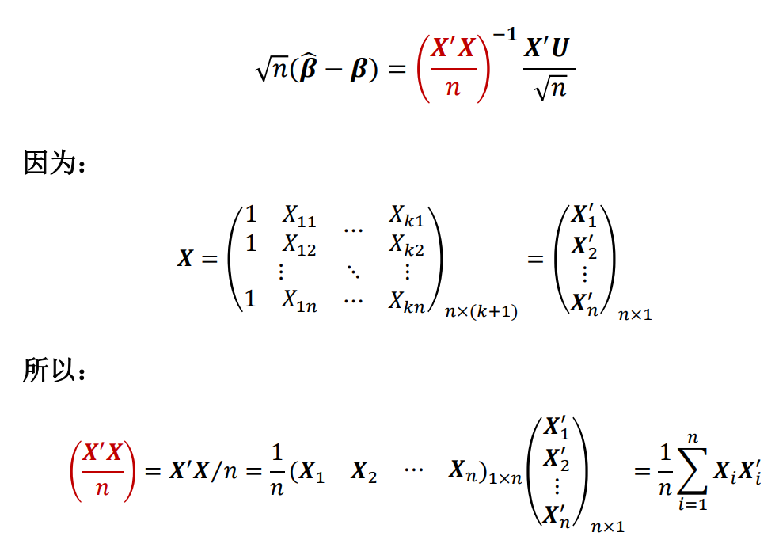
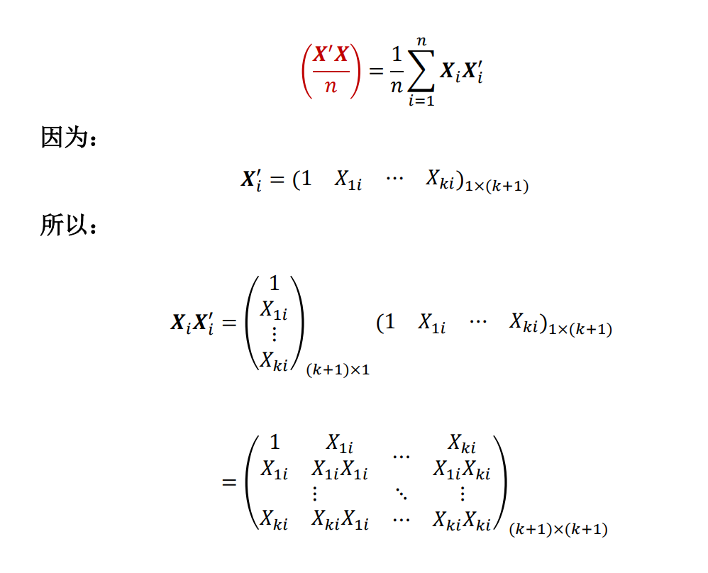
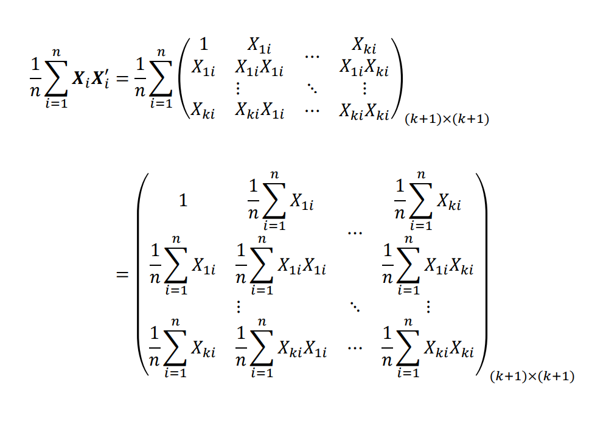
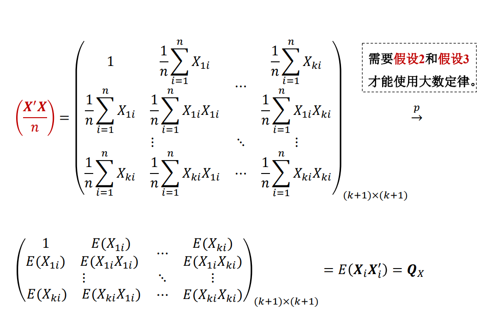
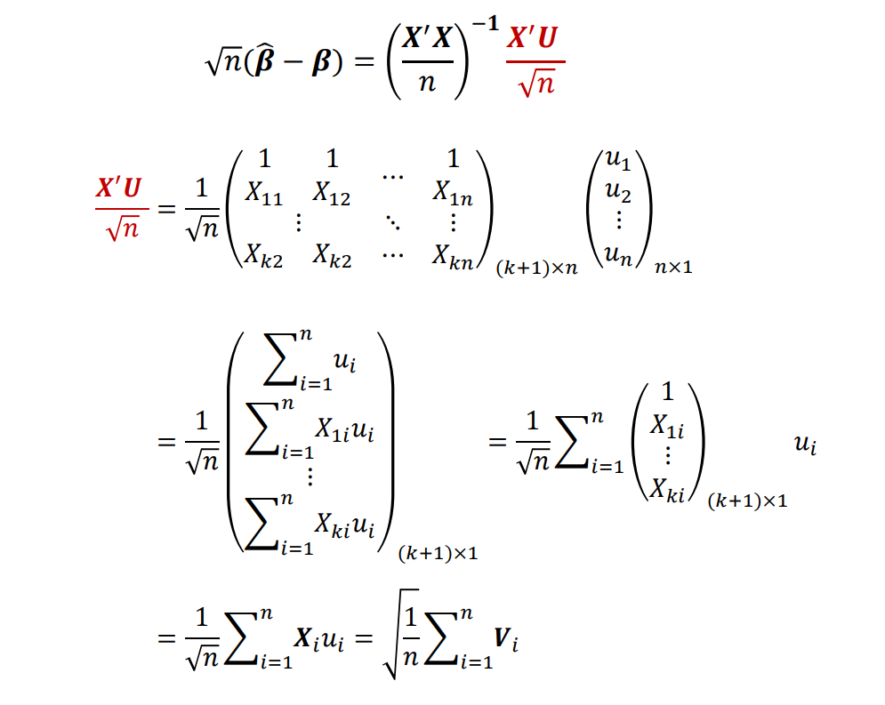

## 遗漏变量（omited variable）
`!$Y_i=\beta_0+\beta_1X_i+u_i.......(i=1,2,...,n)$`

遗漏变量Zi须同时满足下列两个条件：
1. cov(Zi,ui) != 0    Zi能解释Y，和除Xi以外的解释变量相关
2. cov(Zi,Xi) != 0    Zi和Xi相关

遗漏变量导致的问题
1. 遗漏变量导致OLS假设1被违反
	   Xi——Zi——ui，Xi和ui相关，cov（Xi，ui）!= 0，OLS假设1被违反
	   `!$E(u_i|X_i)\ne0$` 
2. 遗漏变量偏差（omitted variables bias）
	  `!$E[ \frac{\Sigma(X_i-\bar X)}{\Sigma(X_i-\bar X)^2}E(u_i|X_i)$`叫遗漏变量误差
	1. 无偏性   β1估计量的期望是β1
	   `!$E(\hat \beta_1) =\beta_1+E[ \frac{\Sigma(X_i-\bar X)}{\Sigma(X_i-\bar X)^2}E(u_i|X_i)]\ne\beta_1$`
	2. 一致性 β1估计量依概率趋近于β1
		   `!$\hat\beta_1—\beta1+\frac{\sigma_{xu}}{\sigma_X^2}\ne\beta_1$`
3. 控制变量（control variable）
	1. 理想的控制变量Zi满足：
	 `!$E[u_i|X_i,Z_i]=E[u_i|Z_i]$`
	 这个条件可以取代OLS假设1
	 >证明可取代性：
	 >`!$Y_i=Y_i=\beta_0+\beta_iX_i+\beta_2Z_i+u_i.$`
	 > 
	

`!$E[Y_i|X=x+\varDelta x,Z=z]-E[Y_i|X=x,Z=z]$`
`!$=\beta_0+\beta_i(x+\varDelta x)+\beta_2z+$`
`!$E[u_i|X=x+\varDelta x,Z=z]-\beta_0+\beta_ix+\beta_2z+$`
`!$E[u_i|X=x,Z=z]=\beta_1\varDelta x$`
x增加Δx，期望增加βΔx，所以x是无偏的

>小结：
>1. 控制变量只保证OLS假设1成立
>2. 控制变量不需要满足 E[ui|Zi]=0
>3. 控制变量的系数β2估计一般是有偏的
>4. `控制变量系数一般不做因果关系解读`

## 多元线性回归模型

1. 基本设定

   `!$Y_i=\beta_0+\beta_1X_{1i}+\beta_2X_{2i}+...+\beta_kX_{ki}+u_i$`
   其中x1i是感兴趣解释变量，其他是控制变量（variable of interest）
   `!$\frac{\partial}{\partial X_{1i}}=\beta_1$`是感兴趣的因果关系
2. 模型的估计
	 `!$Y=X\beta+U$`
	 `!$\hat Y=X\hat\beta$`
	 `!$\hat U = Y-\hat Y = Y- X\hat\beta$`
	 左乘，`!$X^T\hat U=X^T(Y-X\hat\beta)=0$`
	 `!$X^TY-X^TX\hat\beta=0$`
	得：`!$\hat\beta_{(k+1)\times1}=(X^TX)^{-1}X^TY$`
	>证明`!$X^T\hat U=0$`
	>`!$X^T\hat U=(\Sigma \hat u_i,\Sigma X_i\hat u_i,...,\Sigma X_{ki}\hat u_{ki})^T=(0,0,...,0)^T$`
	>原因：F.O.C.1,F.O.C.2

3. 估计量的分布
  假设检验
	1. 声明假设
	2. 计算t统计量 `!$t=\frac{\hat\beta_1-0}{SE(\hat\beta_1)}$`
	`!$\hat\beta = (X^TX)^{-1}X^TY，$`
	`!$带入Y-X\beta+U=(X^TX)^{-1}X^T(X\beta+U)$`
	`!$=\beta+(X^TX)^{-1}X^TU$`
	`!$\sqrt{n}(\hat\beta-\beta)=(\frac{X^TX}{n})^{-1}\frac{X^TU}{\sqrt{n}}$`

令`!$Q_X=E(X_iX_i^T)=(\frac{X^TX}{n})$`
所以：
`!$\hat\beta\sim N(\beta,Q_X^{-1}\sigma_VQ_X^{-1}/n)$`
其中：`!$var(\hat\beta)=Q_X^{-1}\Sigma_VQ_X^{-1}/n$`

`!$\Sigma_V=E(V_iV_i^T), Vi=(u_i,X_iu_i,...,X_{ki}u_i)^T_{1\times(k+1)}$`
`!$V_iV_i^T=u_i^2X_iX_i^T$`
`!$\widehat{var}(\hat\beta)=\hat Q_X^{-1}\hat \Sigma_\hat V\hat Q_X^{-1}/n$`
`!$t=\frac{\beta-0}{SE(\hat\beta_1)}$`

所以：
1）`!$\hat\sigma^2_{\hat\beta_1}在\hat\sigma^2_{\hat\beta}矩阵对角线上的第一个元素$`
2）第j个同理可得
3）`!$SE(\hat\beta_1)=\sqrt{\hat\sigma^2_{\hat\beta_1}}$`