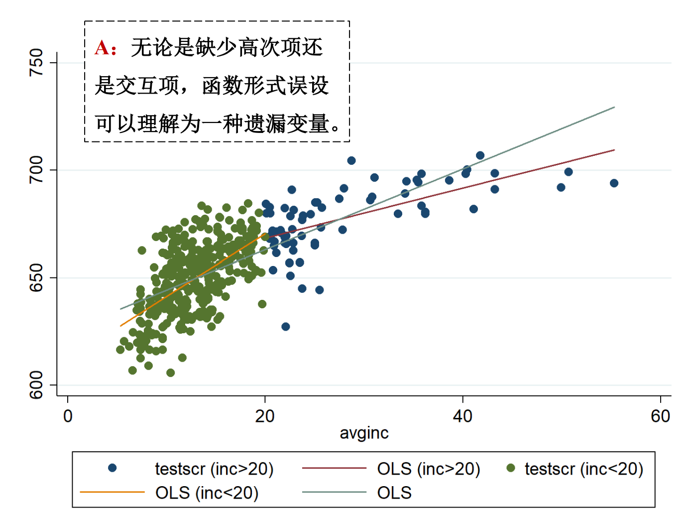

### 集群标准误
估计量关心的三个问题：期望、方差、分布，因为假设二变了，所以方差估计量的方法发生变化——集群SE
集群层面：抽样时选择的层面`不要看数据结构，要看抽样方法`

## 内部和外部有效性
外部和内部有效性的边界：总体来决定
假设F=0.49，且拒绝H0：E(Y)=0.5，即硬币不均匀
1. 该结论是否能适用于其他硬币?（外部的例子）
2. 该结论是否还用于该硬币的其他实验?（内部的例子）

外部有效性：结论在其他总体推广的程度
内部有效性：结论在总体内部推广的程度

一、外部有效性
以美国加州小班教学为例
外部有效性的影响因素（框架）：
1. 大环境：中美国情相似？
2. 小环境：中美课堂相似？
3. 个体：中美学生相似？
4. 时间：23年前的研究在今天有意义？

>1. 大国研究对大国有借鉴意义
>2. 城市研究很难推广到农村
>3. 少数民族研究很难推广到主要民族

### 内部有效性威胁
1. 遗漏变量
	1. 定义： 满足下列条件的就是遗漏变量
 `!$X_i\rightarrow Z_i\rightarrow u_i$`
	2. 后果：
		1. OLS假设1被违反
		2. `!$\hat\beta_1$`有偏且不一致
	3. 解决方法：
		1. 加入控制变量
		2. 固定效应
		3. 随机对照试验RCT
			   `!$Y_i=\beta_0+\beta_1Treat_i+u_i$`由于分组的随机性，treat不和任何相关
		4. 工具变量
2. 函数形式误设
	   1. 定义：
	      和现实的函数形式不一致，如考试成绩的满分为100，应该是非线性模型。
	   
	2. 后果：估计有偏
	 3. 解决方案：非线性回归模型
		1. r阶多系数
		1. 对数模型
		1. 交互项
3. 测量误差（measurement error）
	1. 定义
		1. Xi存在经典误差
			   `!$Y_i=\beta_0+\beta_1X_i+u_i$`
			  其中Xi是没有测量误差的真值，且Xi和ui不相关（满足OLS假设1）。但数据只观测到`!$\tilde{X}$`,则原模型变为
			  `!$Y_i=\beta_0+\beta_1\tilde{X_i}+(\beta_1X_i-\beta_1\tilde{X_i}+u_i)\\Y_i=\beta_0+\beta_1\tilde{X_i}+\tilde{u_i}$`
			  上式的估计：
			  `!$\hat{\beta_1}\rightarrow^p\beta_1+\frac{\sigma_{\tilde u\tilde X}}{\sigma_{\tilde x}^2}=\beta_1+\frac{cov(\tilde{X_i},\tilde{u_i})}{cov(\tilde{X_i},\tilde{X_i})}$`
			  因为`!$\tilde X_i$`存在经典测量误差，即
			  `!$\tilde{X_i}=X_i+\nu_i$`
			  其中`!$\nu_i$`是完全随机的：
				  `!$cov(X_i,\nu_i)=0\\cov(u_i,\nu_i)=0\\var(\nu_i)=\sigma^2_{\nu_i}$`
				  
			  `!$cov(\tilde{X_i},\tilde{u_i})=cov(\tilde{X_i},\beta_1X_i-\beta_1\tilde{X_i}+u_i)\\=\beta_1cov(\tilde{X_i},X_i)-\beta_1cov(\tilde{X_i},\tilde{X_i})+cov(\tilde{X_i},u_i)$`
			  
			  其中：
											  `!$cov(\tilde{X_i},X_i)=cov(X_i+\nu_i,X_i)=\sigma^2_X\\cov(\tilde{X_i},\tilde{X_i})=var(X_i+\nu_i)=\sigma^2_X+\sigma^2_{\nu}\\cov(\tilde{X_i},u_i)=cov(X_i+\nu_i,u_i)=0$` 
			  
			  得：`!$cov(\tilde{X_i},\tilde{u_i})=-\beta_1\sigma^2_{\nu}$`
			   `!$\hat{\beta_1}\rightarrow^p\beta_1+\frac{cov(\tilde{X_i},\tilde{u_i})}{cov(\tilde{X_i},\tilde{X_i})}=\beta_1+\frac{-\beta_1\sigma^2_{\nu}}{\sigma^2_X+\sigma^2_{\nu}}=\beta_1\frac{\sigma_X^2}{\sigma^2_X+\sigma^2_{\nu}}$`
			   
			  当`!$\sigma_{\nu}^2\rightarrow\infty,\hat\beta_1\rightarrow^p 0$`
			  
			后果：
			当Xi存在经典测量误差时，β1的估计量不一致，且随着误差的增大而趋近于0
			  
		2. Yi存在经典测量误差
	  `!$Y_i=\beta_0+\beta_1X_i+u_i$`
			  `!$\tilde{Y_i}=Y_i+\nu_i$`
			  因为`!$\tilde Y_i$`存在经典测量误差，即
			  其中`!$\nu_i$`是完全随机的：
				  `!$cov(Y_i,\nu_i)=0\\cov(u_i,\nu_i)=0\\var(\nu_i)=\sigma^2_{\nu_i}$`
			  
			  引入原模型：
			  `!$Y_i+\nu_i=\beta_0+\beta_1X_i+u_i+\nu_i\\\tilde Y_i=\beta_0+\beta_1X_i+\tilde u_i$`
			  
			  `!$\hat{\beta_1}\rightarrow^p\beta_1+\frac{\sigma_{\tilde uX}}{\sigma_{\tilde x^2}}=\beta_1+\frac{cov(X_i,\tilde{u_i})}{cov(\tilde{X_i},\tilde{X_i})}$`
			   `!$cov(X_i,\tilde{u_i})=cov(X_i,\nu_i+u_i)=0\\$`
		   后果①：当Yi存在经典测量误差时，β1的估计量是一致的
		   
		   **但会对方差有影响！**
		   假设ui是同方差的，`!$var(u_i|X_i)=\sigma^2_u$`
		   同方差适用标准误：
		  `!$var(\hat\beta_1)=\frac{\sigma^2_{\tilde u}}{n\sigma^2_X}$`
		  `!$\sigma^2_{\tilde u_i} = var(u_i+\nu_i)=\sigma_\nu^2+\sigma_u^2>\sigma_u^2$`
		  
			后果②：当Yi存在经典测量误差是，`!$var(\hat\beta_1)$`会偏大，估计变得不准确
		3. 解决方案：
			1. 改善测量方法
			2. 针对误差做出调整
			3. 工具变量（不讲）

4. 数据缺失
	1. 随机的数据缺失
		   后果：n变小，`!$var(\hat\beta_1)$`变大，但仍然是无偏且一致的
	2. 规则已知缺失：
		1. 规则只和Xi有关
			   后果：会改变研究问题，及内部和外部有效性边界`这种规则相当于对变量的控制`
			   e.g. 只用男生数据研究工作经验和薪水
			   一般都是人为的
	    2. 规则和Yi有关
		      后果：估计一般是有偏的
			  e.g.股价为正，才能观测得到
	    3. 规则未知的缺失
		      都是有偏的！
	  3. 由于数据缺失造成的估计偏差，叫做样本选择偏差(sample selection bias)
	     
5. 双向因果关系
	1. 定义：Xi和Yi互为因果
	2. 后果：OLS假设1被违反，β1估计有偏且不一致
		   `!$Y_i=\beta_0+\beta_1X_i+u_i$`
		 其中，`!$E[u_i|X_i]=0,cov(X_i,u_i)=0$`
		 但是，`!$X_i=\gamma_0+\gamma_1Y_i+\nu_i$`
		 `!$cov(X_i,u_i)=cov(\gamma_0+\gamma_1Y_i+\nu_i,u_i)\\=\gamma_1cov(Y_i,u_i)+cov(\nu_i,u_i)\\=\gamma_1cov(\beta_0+\beta_1X_i+u_i,u_i)+cov(\nu_i,u_i)\\=\gamma_1\beta_1cov(X_i,u_i)+\gamma_1cov(u_i,u_i)+cov(\nu_i,u_i)$`
		 假设`!$cov(\nu_i,u_i)=0\rightarrow cov(X_i,u_i)=\frac{\gamma_1\sigma^2_{u}}{1-\gamma_1\beta_1}$`
		 因为γ1不等于0`等于0则双向因果不存在`，则`!$cov(X_i,u_i)\neq0$`
		 所有OLS假设1被违反
	3. 解决方案：
		1. RCT
		2. 工具变量
		3. 当其中一个因果关系已知时，可作相当调整
		   
`!$\matrix{ & 控制 & 固定效应 & RCT &  工具变量 & 非线\\1)遗漏变量 & √ & √ & √ &√ &/\\2)函数形式误设 &/ &/ & /&/ &√\\ 3) 测量误差 & /& /&/ &√&/\\ 4)数据缺失 &/ & /& /& /& /\\ 5)双向因果&/&/& √ & √ &/ }$`
		 

