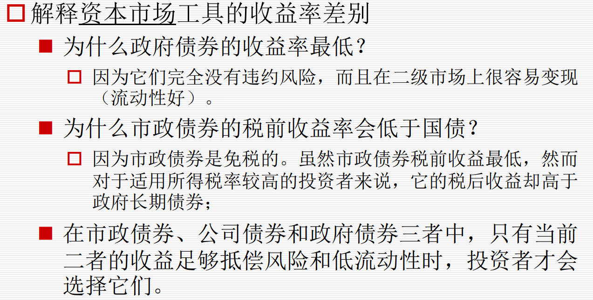
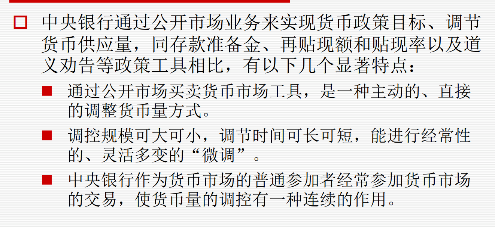

金融机构的作用 结合货币市场和资本市场等市场参与者

- 金融市场(Financial Markets)是买卖金融资产（如股票和债券等），使资金从金融资产的买方流向卖方的市场，其存在为资金供给方（资金盈余方）和资金需求方（资金赤字方）提供了重要的融资渠道。

- 金融资产的经济功能：促进资金流动+转换风险
- 金融市场的功能
	- 聚敛功能 聚集众多分散的小额资金  流动性 +根据不同的期限、收益和风险要求，为投资者提供了多样化的金融工具
	- 配置功能 资源的配置 财富的再分配 风险的再分配
	- 调节功能 直接调节（市场）间接调控（政府的经济政策）
	- 反映功能 反映经济运行 货币供给 企业 世界市场

- 货币市场工具
	- 国库券
	- 大额存单cd
	- 商业票据
	- 同业拆借
	- 央行票据
	- 回购协议
	- 银行承兑汇票

金融市场的参与者 家庭企业政府金融机构 供给和需求者
- 家庭 主要资金供应者 也可能成为资金需求者，如住房抵押贷款等消费贷款。
- 企业是金融市场中主要的资金需求者 也是金融市场中资金的暂时供给者 企业还是金融衍生品市场中重要的套期保值者
- 中央政府与地方政府通常是资金的需求者 也可能是资金的暂时供应者
- 金融机构 存款性金融机构+非。。。

中央银行的作用 金融机构的作用 
- 中央银行作为一国金融体系的核心 
	- 中央银行作为“银行的银行”，充当最后贷款人的角色，是金融市场上资金的提供者
	- 从实施货币政策的角度来看，中央银行执行货币政策，调节货币供应量和利率等中介指标
	- 影响到金融市场上资金的供求及其他参与者的行为

- 金融机构的作用
	- 一个完美的金融市场中，金融中介没有存在的必要，但。。不完美
	- 信息成本及交易成本
	- 金融机构降低交易成本 规模经济+专门技术
	- 交易之前：逆向选择 交易之后：道德风险

- 存款性金融机构的作用
	- 提供存款账户
	- 集中存款资金
	- 承担贷款产生的风险
	- 比存款人拥有更多的专长来评定借款人的信用等级
	- 进行多样化的贷款投资组合

利率的决定：可贷资金理论
- 家庭部门是最大的提供者
- 作为一个整体，家庭部门是可贷资金的净提供者，而政府和企业部门是可贷资金的净需求者

运用可贷资金理论理解理论变动的原因
影响理论变动的主要因素
- 经济增长：总体而言，经济繁荣时，需求曲线向右移动，供给曲线没有明显变化，均衡利率上升
- 通货膨胀：预期上升，人们提前消费，供给曲线左移，需求曲线右移，利率上升
- 货币供给：供给，当中央银行增加货币供给时，可贷资金供给将会增加，产生促使利率下降的压力
- 预算赤字：需求，挤出效应。更高的中央政府赤字将增加在任何一个利率水平上的对可贷资金的需求，导致需求曲线向外移动
- 国外资金流动：供需

预测理论

利率结构 三个 
- 纯粹预期
	- 投资者：资金供给，债券需求
	- 发行者：资金需求，债券供给
- 流动性溢价
- 市场分隔

影响债券收益率的因素，结合债券估值
- 信用风险
- 流动性
- 税收情况 税前*税收=税后
- 期限
- 特殊的条款 ：回购，转换

估算债券收益率
Yn=Rf,n+DP+LP+TA+CALLP+CON

远期利率 两期的会算！

风险机制
投资组合的期望收益和方差
系统风险和非系统风险
- 系统性风险是指整个市场承受到的风险，如经济的景气情况、市场总体利率水平的变化等因为整个市场环境发生变化而产生的风险。
- 非系统性风险是企业特有的风险，诸如企业陷入法律纠纷、罢工、新产品开发失败，等等。

货币市场
每一类货币市场子市场的特定 不同种货币市场的产品的差异
- 国库券市场 折价出售
	- 流动性强 免税 违约风险小 面额小
- 票据市场：本票，汇票，支票
- 商业票据：无担保短期信用负债 ！！！
	- 面值大，到期短，异质性高没有活跃的二级市场，机构投资者
	- 收益率按360天计算
- 银行承兑汇票市场
	- 贴现，存在活跃的二级市场
	- 转贴现，银行之间的融资
- 同业拆借市场
	- 隔夜拆借，信用拆借，市场化程度最高的利率
	- 询价交易
- 回购市场
	- 抵押贷款，以证券为押品
	- 不存在二级市场
	- 回购利率影响因素：
		- 证券质地（信用、流动性）
		- 回购期限长短
		- 交割条件（实物交割利率低）
		- 其他子市场的利率（参考）
	- 质押式回购
		- 风险：正回购方无力回购，欠库（证券价格下跌，质押券不足）
	- 买断式回购
		- 净价交易，全价结算
			- 主动违约，被动违约：逆回购方券不足无法结算，头寸出现问题
	- R：银行间质押式回购，DR：存款类机构质押式回购，且只能是利率债
	- 企业短期融资券：非金融企业
	- 超短融资券
	- 大额可转让存单NCDs 风险溢价流动性风险 有二级市场
	- 货币市场基金 收入式基金 开放型基金 
		- 短期投资 风险低 收益稳定
		- 

国库券、票据。。。哪些有二级市场哪些没有二级市场
	- 商业票据，回购市场没有二级市场

中央银行怎么样参与每个子市场的？
	- 中央银行是银行的银行，它在国民经济中承担着最后贷款人的责任。但在货币市场发达的国家中，商业银行的头寸调整主要是通过货币市场进行的。
	- 中央银行的公开市场业务技术主要有两类，第一类叫做直接业务，另一类便是回购协议及逆回购协议。

收益率、贴现率 
- 国库券、回购协议贴现率 360，商业票据的收益率 其他365

利率对货币市场工具的影响 反比 

发行拍卖交易细节不需要掌握

### 债券估值
利率债和信用债 
可赎回可转换价值的分析
金融机构扮演的角色
债券估值的计算
债券的不同属性的影响 息票率 可赎回可转换！！ 税收 流动性 违约风险
价格利率敏感性的分析
全价+净价+应付利息
久期 估算小的利率波动 久期免疫

### 股票市场
分类 基本情况
普通股和优先股的权利
- 普通股是在优先股要求权得到满足之后才参与公司利润和资产分配的股票，它代表着最终的剩余索取权。
- 优先股：它与普通股股票相对应，是指股东享有某些优先权利（如优先分配公司盈利和剩余财产）的股票。但没有生产经营权、决策权。
	- 经营决策参与权、表决权？
	- 风险？
	- 稳定的股利？优先股优先，且股利确定
	- 剩余索取的顺序？优先股优先
	- 优先认股权？普通股有优先认股权
	- 不能退股，但大多数优先股有赎回条款

外资参与股市的途径 b股 QFII 沪港通深港通
IPo发行制度的区别
- 审批制
	- 初期，分配上市额度，推荐股票的发行
- 核准制
	- 申请发行股票，充分公开企业的真实情况，而且必须符合有关法律和证券监管机构规定的必要条件，证券监管机构有权否决不符合规定条件的股票发行申请 主板、中小板
	- 证监会审核，发审委投票
- 注册制
	- 有关的一切信息和资料公开，主管机构只负责审查发行申请人提供的信息和资料是否履行了信息披露义务的一种制度。形式审查，不进行实质判断
	- 审批权限下放到交易所

发行价格的估算 完全摊薄法和加权平均法
- PE法，P=EPS*PE
- 完全摊薄法，加权平均法

做市商交易和。。的不同
- 做市商交易制度，报价驱动（Quote-driven）
	- 做市商垫资建仓
	- 与做市商交易，投资者之间不交易
	- 价格由做市商决定
	- 有助于提高股票的流动性，增强对证券吸引力，能稳定市场
	- 有价格发现的功能
	- 存货管理风险，信息不对称风险
- 竞价交易制度，委托驱动（Order-driven）
	- 订单簿

限价订单 市价订单 止损订单
- 限价订单
	- 规定价格，或按照比限定价格更有利的价格成交
	- 价格风险可控
	- 可能无法成交
- 市价订单
	- 不规定价格规定数量，按照最好的价格成交
	- 交易速度快，
	- 价格可能不理想
- 止损订单
	- 限制性的市价委托
	- 下跌到某个价格按市价卖出，上涨到某个价格按照市价卖出

根据价格优先和时间优先成交股票 那一部分成交 哪些没有 集合竞价不考
保证金交易
融资融券交易
保证金怎么变 什么时候追加保证金
除权除息 会算

股票指数不考

股票估值 零增长 戈登公式 多期
CAPM模型
三种有效市场

衍生品 几个计算

 把St>K时的看涨期权称为实值期权（In the money）
 把St=K时的看涨期权称为平价期权（At the money）
 把St<K时的看涨期权称为虚值期权（Out of money）

期权与期货的区别
- 权利和义务 
	- 期权合约赋予他的只有权利，而没有任何义务
- 标准化 
	- 期货都是标准化的，但期权不一定
- 盈亏风险 
	- 期货交易的双方盈亏风险都是无限的。期权不一定
- 保证金 
	- 期货交易的双方都需要缴纳保证金。 
	- 期货交易的双方都需要缴纳保证金。
- 买卖匹配
	- 期货到期必须执行，期权不一定
- 套期保值
	- 利用期货进行套期保值时，把不利风险和有利风险全转移出去。
	- 期权只转移不利风险（可以不行权）
